# Diagramas de Arquitectura - TEMIS
## Diagramas Técnicos del Sistema

---

## 1. Arquitectura General del Sistema

```mermaid
graph TB
    subgraph "Frontend Layer"
        MobileApp[App Móvil<br/>React Native<br/>iOS + Android]
        WebAdmin[Web Admin<br/>Angular<br/>Superusuario]
    end

    subgraph "AWS Cloud"
        subgraph "API Layer"
            APIGateway[API Gateway<br/>REST API]
            Authorizer[Lambda Authorizer<br/>JWT Validation RS256]
        end

        subgraph "Security Services"
            ParamStore[AWS Parameter Store<br/>JWT Keys RS256]
        end

        subgraph "Business Logic"
            LambdaTasks[Lambda Functions<br/>Tasks Module]
            LambdaPasswords[Lambda Functions<br/>Passwords Module]
            LambdaFinance[Lambda Functions<br/>Finance Module]
            LambdaAdmin[Lambda Functions<br/>Admin Module]
            LambdaVoice[Lambda<br/>Voice Processing]
            LambdaAI[Lambda<br/>AI Chat & Insights]
        end

        subgraph "Data Layer"
            RDS[(RDS PostgreSQL<br/>db.t4g.micro)]
        end

        subgraph "AI Services"
            Bedrock[Amazon Bedrock<br/>Claude 3.5 Sonnet]
            Transcribe[AWS Transcribe<br/>Speech-to-Text]
        end

        subgraph "Storage & Services"
            S3[S3 Bucket<br/>Files & Backups]
            SNS[SNS<br/>Push Notifications]
            SES[SES<br/>Email Service]
            CloudWatch[CloudWatch<br/>Logs & Metrics]
            EventBridge[EventBridge<br/>Scheduled Tasks]
        end
    end

    MobileApp -->|HTTPS + JWT| APIGateway
    WebAdmin -->|HTTPS + JWT| APIGateway

    APIGateway --> Authorizer
    Authorizer --> ParamStore

    APIGateway --> LambdaTasks
    APIGateway --> LambdaPasswords
    APIGateway --> LambdaFinance
    APIGateway --> LambdaAdmin
    APIGateway --> LambdaVoice
    APIGateway --> LambdaAI

    LambdaTasks --> RDS
    LambdaPasswords --> RDS
    LambdaFinance --> RDS
    LambdaAdmin --> RDS
    LambdaVoice --> RDS
    LambdaAI --> RDS

    LambdaVoice --> Transcribe
    LambdaVoice --> Bedrock
    LambdaAI --> Bedrock

    LambdaFinance --> S3
    LambdaAdmin --> S3
    LambdaVoice --> S3

    EventBridge --> LambdaTasks

    LambdaTasks --> SNS
    LambdaFinance --> SNS
    LambdaAdmin --> SES

    LambdaTasks -.->|Logs| CloudWatch
    LambdaPasswords -.->|Logs| CloudWatch
    LambdaFinance -.->|Logs| CloudWatch
    LambdaAdmin -.->|Logs| CloudWatch
    LambdaVoice -.->|Logs| CloudWatch
    LambdaAI -.->|Logs| CloudWatch
```

---

## 2. Arquitectura de Red (VPC)

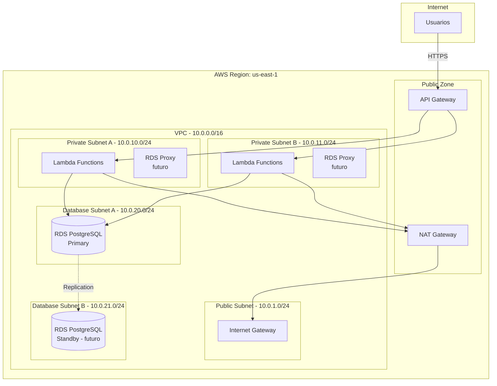

---

## 3. Flujo de Autenticación JWT

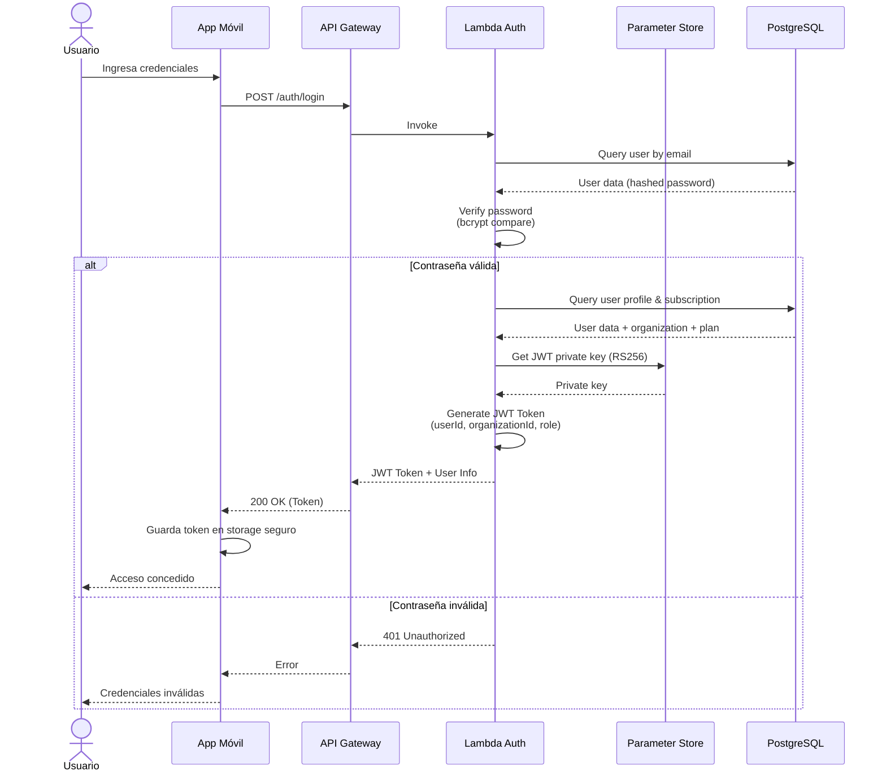

---

## 4. Flujo de Operación CRUD (Tareas)

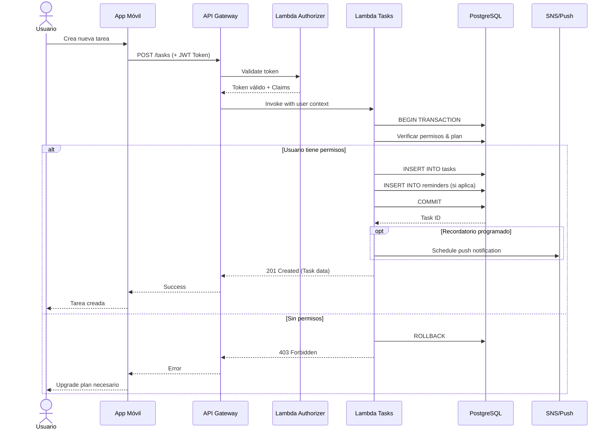

---

## 5. Flujo de Registro por Voz (Tareas y Finanzas)

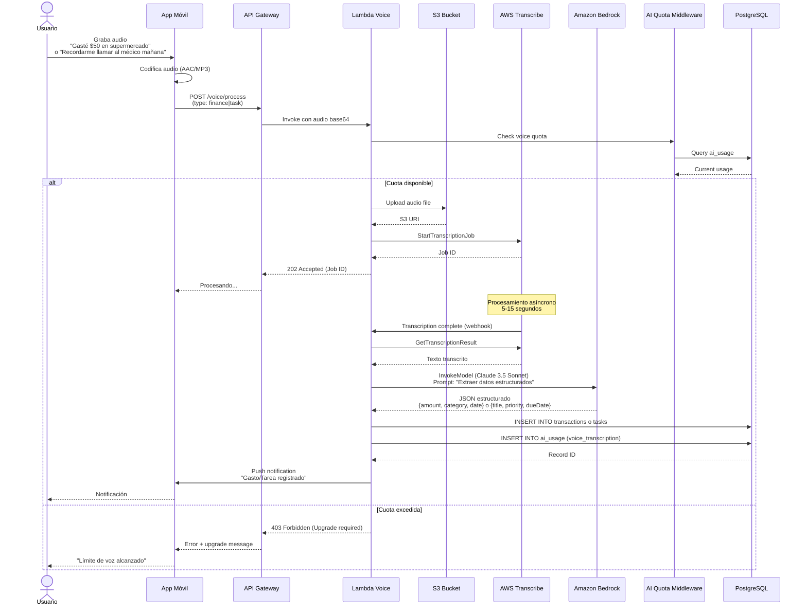

---

## 6. Flujo de Captura Automática de SMS

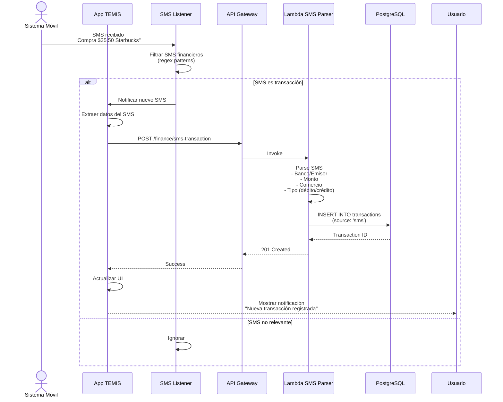

---

## 7. Flujo de Chat IA Conversacional

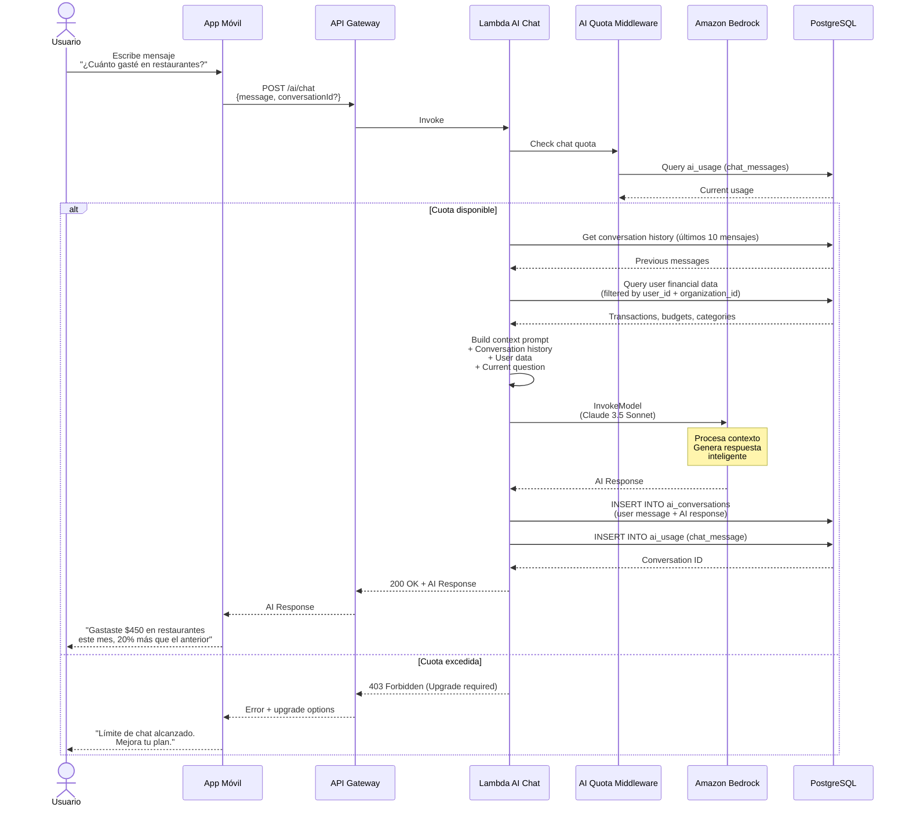

---

## 8. Modelo de Datos Multitenancy

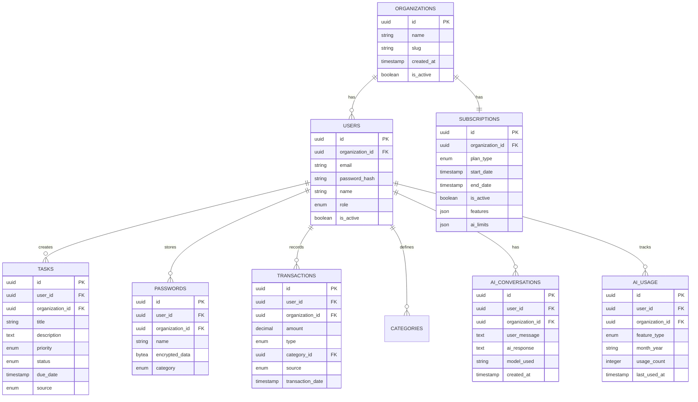

---

## 9. Arquitectura de Seguridad

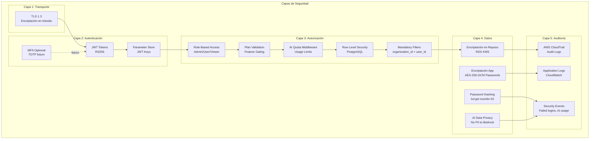

---

## 10. Ciclo de Vida de Suscripción

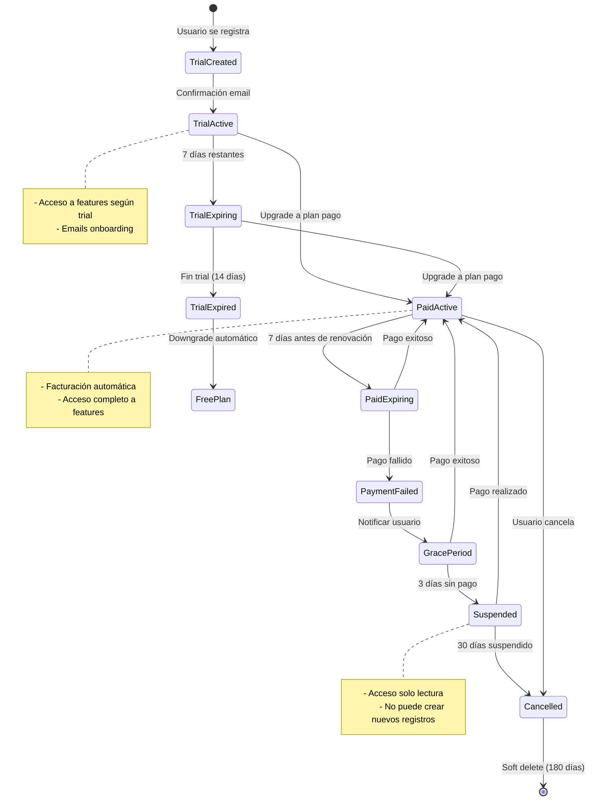

---

## 11. Despliegue CI/CD

```mermaid
graph LR
    subgraph "Development"
        Dev[Desarrollador]
        Git[GitHub Repo]
    end

    subgraph "CI/CD Pipeline"
        subgraph "Build Stage"
            Checkout[Checkout Code]
            Install[Install Dependencies]
            Lint[Lint & Format]
            Test[Run Tests]
            Build[Build Artifacts]
        end

        subgraph "Deploy Stage"
            DeployDev[Deploy to Dev]
            IntegrationTest[Integration Tests]
            DeployStaging[Deploy to Staging]
            E2ETest[E2E Tests]
            Approval[Manual Approval]
            DeployProd[Deploy to Production]
        end
    end

    subgraph "Environments"
        EnvDev[Dev Environment<br/>AWS Account Dev]
        EnvStaging[Staging Environment<br/>AWS Account Staging]
        EnvProd[Production Environment<br/>AWS Account Prod]
    end

    Dev -->|git push| Git
    Git -->|trigger| Checkout
    Checkout --> Install
    Install --> Lint
    Lint --> Test
    Test --> Build

    Build -->|Serverless Deploy| DeployDev
    DeployDev --> EnvDev
    DeployDev --> IntegrationTest

    IntegrationTest -->|Pass| DeployStaging
    DeployStaging --> EnvStaging
    DeployStaging --> E2ETest

    E2ETest -->|Pass| Approval
    Approval -->|Approved| DeployProd
    DeployProd --> EnvProd

    DeployProd -->|Rollback if error| DeployStaging
```

---

## 12. Monitoreo y Observabilidad

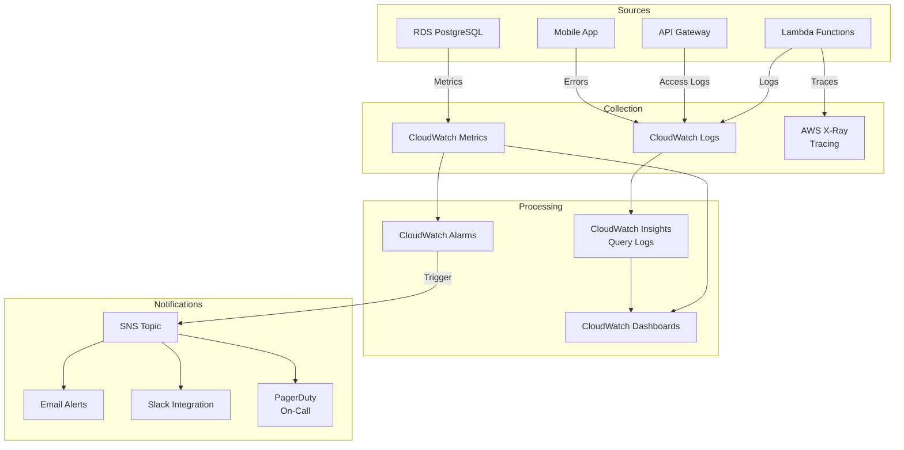

---

## 13. Estrategia de Backup y Recovery

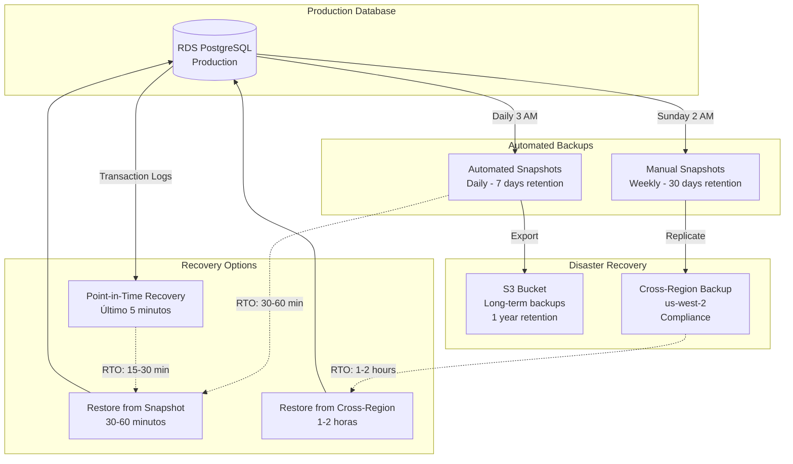

---

## Changelog

### v1.1.0 (2026-07-12)
- ✅ Actualizada arquitectura con Amazon Bedrock (Claude 3.5 Sonnet)
- ✅ Eliminado AWS Cognito, implementado JWT con Parameter Store (RS256)
- ✅ Agregado Lambda AI Chat y Lambda Voice Processing
- ✅ Nuevo diagrama: Flujo de Chat IA Conversacional
- ✅ Actualizado: Flujo de Voz incluye tareas y finanzas con IA
- ✅ Modelo de datos actualizado con tablas AI (ai_conversations, ai_usage)
- ✅ Arquitectura de seguridad actualizada (AI Quota Middleware, filtros obligatorios)
- ✅ Diagrama de autenticación actualizado (JWT sin Cognito)

### v1.0.0 (2026-07-12)
- Versión inicial con 12 diagramas base

---

**Documento creado**: 2026-07-12
**Última actualización**: 2026-07-12
**Versión**: 1.1.0

**Nota**: Los diagramas Mermaid se pueden visualizar en:
- GitHub (renderizado automático)
- VS Code (con extensión Mermaid)
- [Mermaid Live Editor](https://mermaid.live)
