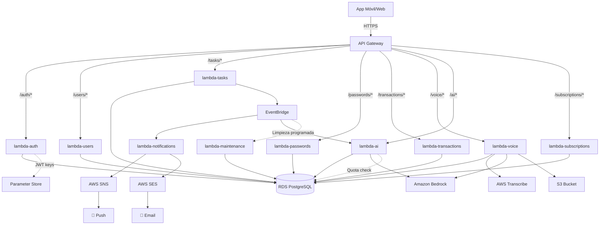

# Infraestructura AWS - TEMIS
## Arquitectura Serverless con Microservicios

---

## 1. Visión General

TEMIS utiliza una arquitectura serverless completamente gestionada en AWS con lambdas como microservicios independientes.

### 1.1 Servicios AWS Utilizados

```
┌─────────────────────────────────────────────────────────────┐
│                      AWS Cloud (us-east-1)                  │
├─────────────────────────────────────────────────────────────┤
│ Compute:        AWS Lambda (15+ funciones)                  │
│ API:            API Gateway (REST API)                       │
│ Database:       RDS PostgreSQL (db.t4g.micro)              │
│ Storage:        S3 (archivos, backups)                      │
│ Auth:           Parameter Store (JWT keys)                  │
│ Notifications:  SNS (push), SES (email)                     │
│ AI Services:    Amazon Bedrock (Claude 3.5 Sonnet)         │
│                 AWS Transcribe (Speech-to-Text)              │
│ Scheduling:     EventBridge (tareas programadas)            │
│ Monitoring:     CloudWatch Logs + Metrics                    │
│ Networking:     VPC, Security Groups                         │
└─────────────────────────────────────────────────────────────┘
```

---

## 2. Arquitectura de Microservicios

### 2.1 Lambdas como Microservicios

Cada Lambda gestiona el CRUD completo de una entidad:

```
┌──────────────────┬────────────────────┬────────────────────────────┐
│ Lambda           │ Tabla Principal    │ Responsabilidad            │
├──────────────────┼────────────────────┼────────────────────────────┤
│ lambda-auth      │ users,             │ Autenticación JWT          │
│                  │ refresh_tokens     │                            │
├──────────────────┼────────────────────┼────────────────────────────┤
│ lambda-users     │ users              │ CRUD usuarios              │
├──────────────────┼────────────────────┼────────────────────────────┤
│ lambda-tasks     │ tasks,             │ CRUD tareas                │
│                  │ task_tags          │                            │
├──────────────────┼────────────────────┼────────────────────────────┤
│ lambda-tags      │ tags               │ CRUD etiquetas             │
├──────────────────┼────────────────────┼────────────────────────────┤
│ lambda-reminders │ reminders          │ CRUD recordatorios         │
├──────────────────┼────────────────────┼────────────────────────────┤
│ lambda-passwords │ passwords          │ CRUD contraseñas           │
├──────────────────┼────────────────────┼────────────────────────────┤
│ lambda-          │ transactions,      │ CRUD transacciones,        │
│ transactions     │ sms_messages       │ reportes                   │
├──────────────────┼────────────────────┼────────────────────────────┤
│ lambda-voice     │ N/A                │ Procesamiento de voz       │
│                  │                    │ (Transcribe + Bedrock)     │
├──────────────────┼────────────────────┼────────────────────────────┤
│ lambda-ai        │ ai_conversations,  │ Chat IA, insights,         │
│                  │ ai_usage           │ predicciones               │
├──────────────────┼────────────────────┼────────────────────────────┤
│ lambda-          │ categories         │ CRUD categorías            │
│ categories       │                    │                            │
├──────────────────┼────────────────────┼────────────────────────────┤
│ lambda-budgets   │ budgets            │ CRUD presupuestos          │
├──────────────────┼────────────────────┼────────────────────────────┤
│ lambda-          │ subscriptions,     │ Gestión suscripciones      │
│ subscriptions    │ plans              │                            │
├──────────────────┼────────────────────┼────────────────────────────┤
│ lambda-          │ N/A                │ Push & Email               │
│ notifications    │                    │                            │
├──────────────────┼────────────────────┼────────────────────────────┤
│ lambda-          │ audit_logs,        │ Limpieza programada de     │
│ maintenance      │ refresh_tokens,    │ datos obsoletos            │
│                  │ ai_conversations   │                            │
├──────────────────┼────────────────────┼────────────────────────────┤
│ lambda-admin     │ múltiples          │ Operaciones admin          │
└──────────────────┴────────────────────┴────────────────────────────┘
```

### 2.2 Diagrama de Flujo



---

## 3. API Gateway

### 3.1 Configuración

```yaml
Type: REST API
Name: temis-api-{env}
Region: us-east-1
Endpoint Type: Regional
Throttling:
  Rate Limit: 1000 req/sec
  Burst Limit: 2000 req
```

### 3.2 Rutas y Métodos

```
API Gateway: /v1

├── /auth
│   ├── POST   /register        → lambda-auth
│   ├── POST   /login           → lambda-auth
│   ├── POST   /refresh         → lambda-auth
│   ├── POST   /logout          → lambda-auth
│   ├── POST   /forgot-password → lambda-auth
│   └── POST   /reset-password  → lambda-auth
│
├── /users
│   ├── GET    /me              → lambda-users
│   ├── PUT    /me              → lambda-users
│   ├── POST   /me/change-password → lambda-users
│   ├── POST   /me/avatar       → lambda-users
│   └── DELETE /me              → lambda-users
│
├── /tasks
│   ├── GET    /                → lambda-tasks
│   ├── POST   /                → lambda-tasks
│   ├── GET    /{id}            → lambda-tasks
│   ├── PUT    /{id}            → lambda-tasks
│   ├── DELETE /{id}            → lambda-tasks
│   ├── POST   /{id}/complete   → lambda-tasks
│   └── GET    /stats           → lambda-tasks
│
├── /passwords
│   ├── GET    /                → lambda-passwords
│   ├── POST   /                → lambda-passwords
│   ├── GET    /{id}            → lambda-passwords
│   ├── PUT    /{id}            → lambda-passwords
│   ├── DELETE /{id}            → lambda-passwords
│   ├── POST   /generate        → lambda-passwords
│   └── GET    /audit           → lambda-passwords
│
├── /transactions
│   ├── GET    /                → lambda-transactions
│   ├── POST   /                → lambda-transactions
│   ├── POST   /sms             → lambda-transactions
│   ├── GET    /dashboard       → lambda-transactions
│   ├── POST   /reports         → lambda-transactions
│   └── GET    /reports/{id}    → lambda-transactions
│
├── /voice
│   ├── POST   /tasks           → lambda-voice
│   ├── POST   /transactions    → lambda-voice
│   └── GET    /{jobId}/status  → lambda-voice
│
├── /ai
│   ├── POST   /chat            → lambda-ai
│   ├── GET    /chat/history    → lambda-ai
│   ├── POST   /insights        → lambda-ai
│   ├── GET    /insights/latest → lambda-ai
│   ├── POST   /predictions     → lambda-ai
│   ├── GET    /usage           → lambda-ai
│   └── GET    /quota           → lambda-ai
│
└── [otras rutas...]
```

### 3.3 Authorizer

Lambda Authorizer para validar JWT en cada request (excepto /auth):

```javascript
// lambda-authorizer (función compartida)
exports.handler = async (event) => {
  const token = event.headers.Authorization?.replace('Bearer ', '');

  if (!token) {
    return generatePolicy('user', 'Deny', event.methodArn);
  }

  try {
    // Obtener clave pública de Parameter Store
    const publicKey = await getParameter('/temis/jwt-public-key');

    // Verificar JWT
    const decoded = jwt.verify(token, publicKey, { algorithms: ['RS256'] });

    // Generar policy con contexto de usuario
    return generatePolicy(decoded.userId, 'Allow', event.methodArn, {
      userId: decoded.userId,
      organizationId: decoded.organizationId,
      role: decoded.role,
      planId: decoded.planId
    });
  } catch (error) {
    return generatePolicy('user', 'Deny', event.methodArn);
  }
};
```

### 3.4 CORS Configuration

```json
{
  "AllowOrigins": [
    "https://app.temis.com",
    "https://admin.temis.com",
    "http://localhost:3000"
  ],
  "AllowMethods": ["GET", "POST", "PUT", "DELETE", "OPTIONS"],
  "AllowHeaders": [
    "Content-Type",
    "Authorization",
    "X-Device-ID",
    "X-App-Version"
  ],
  "MaxAge": 3600
}
```

---

## 4. AWS Lambda Functions

### 4.1 Configuración Base de Lambdas

```yaml
Runtime: nodejs18.x
Architecture: arm64  # Graviton2 (más barato)
Memory: 512 MB (ajustar según lambda)
Timeout: 30 segundos (API calls)
         300 segundos (procesamiento async)
Environment Variables:
  - DB_HOST
  - DB_PORT
  - DB_NAME
  - DB_USER
  - DB_PASSWORD_SECRET_ARN
  - JWT_KEYS_PARAM_PATH
  - SNS_TOPIC_ARN
  - S3_BUCKET_NAME
  - ENVIRONMENT (dev/staging/prod)
```

### 4.2 Especificaciones por Lambda

#### lambda-auth
```yaml
Memory: 256 MB
Timeout: 10s
Concurrency: 100 (Reserved)
Triggers:
  - API Gateway: /auth/*
Permissions:
  - Parameter Store: Read (JWT keys)
  - RDS: Full access (users, refresh_tokens)
  - SES: SendEmail (verificación)
```

#### lambda-users
```yaml
Memory: 256 MB
Timeout: 10s
Triggers:
  - API Gateway: /users/*
Permissions:
  - RDS: Full access (users table)
  - S3: PutObject (avatar uploads)
```

#### lambda-tasks
```yaml
Memory: 512 MB
Timeout: 15s
Triggers:
  - API Gateway: /tasks/*
Permissions:
  - RDS: Full access (tasks, task_tags, reminders)
  - EventBridge: PutRule, PutTargets (recordatorios)
```

#### lambda-passwords
```yaml
Memory: 512 MB
Timeout: 10s
Triggers:
  - API Gateway: /passwords/*
Permissions:
  - RDS: Full access (passwords table)
  - Parameter Store: Read (encryption keys)
Security:
  - Encryption at rest
  - Audit logging enabled
```

#### lambda-transactions
```yaml
Memory: 512 MB
Timeout: 30s
Triggers:
  - API Gateway: /transactions/*
Permissions:
  - RDS: Full access (transactions, sms_messages)
  - Lambda: InvokeFunction (lambda-notifications)
```

#### lambda-voice
```yaml
Memory: 1024 MB  # Mayor por procesamiento de voz + IA
Timeout: 60s
Triggers:
  - API Gateway: /voice/*
Permissions:
  - RDS: Full access (tasks, transactions, ai_usage)
  - S3: PutObject, GetObject (audio files)
  - Transcribe: StartTranscriptionJob, GetTranscriptionJob
  - Bedrock: InvokeModel
  - Lambda: InvokeFunction (lambda-notifications)
Environment:
  - BEDROCK_MODEL_ID: anthropic.claude-3-5-sonnet-20241022-v2:0
  - BEDROCK_REGION: us-east-1
```

#### lambda-ai
```yaml
Memory: 1024 MB  # Mayor por procesamiento IA
Timeout: 45s
Concurrency: 50 (Reserved para control de costos)
Triggers:
  - API Gateway: /ai/*
  - EventBridge: Insights automáticos (lunes 9 AM)
Permissions:
  - RDS: Full access (ai_conversations, ai_usage, transactions, tasks, users)
  - Bedrock: InvokeModel
  - SNS: Publish (notificaciones de insights)
Environment:
  - BEDROCK_MODEL_ID: anthropic.claude-3-5-sonnet-20241022-v2:0
  - BEDROCK_REGION: us-east-1
  - MAX_CONVERSATION_HISTORY: 10
Monitoring:
  - Alarms on high invocation count (cost control)
  - Alarms on high duration (> 30s)
```

#### lambda-notifications
```yaml
Memory: 256 MB
Timeout: 30s
Triggers:
  - EventBridge: Recordatorios programados
  - Lambda: Invoke from other functions
  - SNS: Dead Letter Queue
Permissions:
  - SNS: Publish (push notifications)
  - SES: SendEmail
  - RDS: Read (tasks, users, reminders)
```

#### lambda-maintenance
```yaml
Memory: 256 MB
Timeout: 300s  # 5 minutos para limpieza de grandes volúmenes
Triggers:
  - EventBridge: Limpiezas programadas (diaria/mensual)
Permissions:
  - RDS: Full access (DELETE en audit_logs, refresh_tokens, ai_conversations, payment_audit_logs)
  - CloudWatch: PutMetricData (métricas de registros eliminados)
Schedule:
  - cleanup-audit-logs: Mensual (día 1, 3 AM)
  - cleanup-refresh-tokens: Diario (4 AM)
  - cleanup-conversations: Mensual (día 1, 3:30 AM)
  - cleanup-payment-logs: Mensual (día 1, 4 AM)
Monitoring:
  - Alarms on failures (> 2 errores/día)
  - Logs: Cantidad de registros eliminados por ejecución
```

---

## 5. Base de Datos RDS

### 5.1 Configuración

```yaml
Engine: PostgreSQL 15.x
Instance Class: db.t4g.micro
vCPUs: 2
RAM: 1 GB
Storage: 20 GB SSD (gp3)
Storage Autoscaling: Enabled (max 100 GB)
Multi-AZ: No (habilitarlo en producción)
Backup:
  Automated: Yes
  Retention: 7 días
  Window: 03:00-04:00 UTC
  Manual Snapshots: Semanales
Maintenance Window: Sun 04:00-05:00 UTC
Encryption: Yes (AWS KMS)
```

### 5.2 VPC y Networking

```
VPC: temis-vpc (10.0.0.0/16)

├── Public Subnet A (10.0.1.0/24) - us-east-1a
│   └── NAT Gateway
│
├── Public Subnet B (10.0.2.0/24) - us-east-1b
│   └── NAT Gateway (opcional, multi-AZ)
│
├── Private Subnet A (10.0.10.0/24) - us-east-1a
│   └── Lambda Functions (ENI)
│
├── Private Subnet B (10.0.11.0/24) - us-east-1b
│   └── Lambda Functions (ENI)
│
├── Database Subnet A (10.0.20.0/24) - us-east-1a
│   └── RDS Primary
│
└── Database Subnet B (10.0.21.0/24) - us-east-1b
    └── RDS Standby (futuro Multi-AZ)
```

### 5.3 Security Groups

#### SG-Lambda
```yaml
Name: temis-lambda-sg
Inbound:
  - None (lambdas inician conexiones)
Outbound:
  - 0.0.0.0/0:443 (HTTPS)
  - RDS-SG:5432 (PostgreSQL)
```

#### SG-RDS
```yaml
Name: temis-rds-sg
Inbound:
  - Lambda-SG:5432
  - Bastion-SG:5432 (solo para debug)
Outbound:
  - None
```

### 5.4 Connection Pooling

**Problema**: Lambdas crean múltiples conexiones a RDS.

**Solución Actual**: Pool de conexiones en cada Lambda
```javascript
const { Pool } = require('pg');

const pool = new Pool({
  host: process.env.DB_HOST,
  port: process.env.DB_PORT,
  database: process.env.DB_NAME,
  user: process.env.DB_USER,
  password: process.env.DB_PASSWORD,
  max: 5,  // Máximo 5 conexiones por lambda instance
  idleTimeoutMillis: 30000,
  connectionTimeoutMillis: 2000
});
```

**Solución Futura**: RDS Proxy (cuando haya más tráfico)
```yaml
RDS Proxy:
  Name: temis-rds-proxy
  Target: temis-rds-instance
  Max Connections: 100
  Connection Borrow Timeout: 120s
  Init Query: SET app.current_user_id = ?
```

---

## 6. Parameter Store

### 6.1 Parámetros Almacenados

```
/temis/{env}/jwt-private-key      (SecureString)
/temis/{env}/jwt-public-key       (SecureString)
/temis/{env}/db-password          (SecureString)
/temis/{env}/stripe-api-key       (SecureString)
/temis/{env}/encryption-master-key (SecureString)
/temis/{env}/config               (String)
```

### 6.2 Acceso desde Lambda

```javascript
const AWS = require('aws-sdk');
const ssm = new AWS.SSM();

async function getParameter(name) {
  const result = await ssm.getParameter({
    Name: name,
    WithDecryption: true
  }).promise();

  return result.Parameter.Value;
}

// Cache en memoria (válido durante lifetime del container)
let cachedPrivateKey;

async function getJWTPrivateKey() {
  if (!cachedPrivateKey) {
    cachedPrivateKey = await getParameter('/temis/prod/jwt-private-key');
  }
  return cachedPrivateKey;
}
```

---

## 7. S3 Storage

### 7.1 Buckets

```
temis-{env}-uploads
├── avatars/
│   └── user_{id}.jpg
├── audio/
│   └── voice_{jobId}.mp3
└── temp/

temis-{env}-reports
├── pdf/
│   └── report_{id}.pdf
└── excel/
    └── report_{id}.xlsx

temis-{env}-backups
├── database/
│   └── snapshot_{date}.sql
└── exports/
    └── user_{id}_export.zip
```

### 7.2 Lifecycle Policies

```yaml
temis-uploads/audio/:
  - Delete after 7 days

temis-reports/:
  - Move to Glacier after 30 days
  - Delete after 90 days

temis-backups/database/:
  - Keep forever (o según política)
```

### 7.3 CORS Configuration

```json
{
  "CORSRules": [
    {
      "AllowedOrigins": ["https://app.temis.com"],
      "AllowedMethods": ["GET", "PUT", "POST"],
      "AllowedHeaders": ["*"],
      "MaxAgeSeconds": 3000
    }
  ]
}
```

---

## 8. AWS SNS (Push Notifications)

### 8.1 Platform Applications

```yaml
# iOS
Platform: APNS (Apple Push Notification Service)
Certificate: Subir certificado .p12 de Apple Developer
Environment: Production / Sandbox

# Android
Platform: FCM (Firebase Cloud Messaging)
API Key: Firebase Server Key
```

### 8.2 Topics

```yaml
temis-urgent-alarms-{env}
temis-normal-notifications-{env}
temis-admin-alerts-{env}
```

### 8.3 Envío de Notificación

```javascript
const AWS = require('aws-sdk');
const sns = new AWS.SNS();

async function sendPushNotification(userId, message, priority) {
  const devices = await getUserDevices(userId);

  for (const device of devices) {
    const notification = formatNotificationByPriority(message, priority);

    await sns.publish({
      TargetArn: device.endpointArn,
      Message: JSON.stringify(notification),
      MessageStructure: 'json'
    });
  }
}

function formatNotificationByPriority(message, priority) {
  const isAlarm = (priority === 'urgent' || priority === 'high');

  return {
    default: message.body,
    APNS: JSON.stringify({
      aps: {
        alert: {
          title: message.title,
          body: message.body
        },
        sound: isAlarm ? {
          critical: true,
          name: 'alarm_sound.caf',
          volume: 1.0
        } : 'default',
        interruptionLevel: isAlarm ? 'critical' : 'active'
      }
    }),
    GCM: JSON.stringify({
      notification: {
        title: message.title,
        body: message.body
      },
      android: {
        priority: isAlarm ? 'max' : 'high',
        channelId: isAlarm ? 'urgent_alarms' : 'task_reminders'
      }
    })
  };
}
```

---

## 9. AWS EventBridge

### 9.1 Programar Recordatorios

```javascript
const AWS = require('aws-sdk');
const eventbridge = new AWS.EventBridge();

async function scheduleReminder(reminder) {
  const ruleName = `reminder-${reminder.id}`;

  // Crear regla programada
  await eventbridge.putRule({
    Name: ruleName,
    ScheduleExpression: `at(${reminder.remindAt.toISOString()})`,
    State: 'ENABLED',
    Description: `Recordatorio para tarea ${reminder.taskId}`
  }).promise();

  // Configurar lambda-notifications como target
  await eventbridge.putTargets({
    Rule: ruleName,
    Targets: [{
      Id: '1',
      Arn: process.env.LAMBDA_NOTIFICATIONS_ARN,
      Input: JSON.stringify({
        type: 'reminder',
        reminderId: reminder.id,
        userId: reminder.userId,
        taskId: reminder.taskId,
        priority: reminder.priority  // Para determinar alarma vs notificación
      })
    }]
  }).promise();
}
```

### 9.2 Reglas Recurrentes

```yaml
# Generar insights semanales automáticos con IA
Rule: weekly-ai-insights
Schedule: cron(0 9 ? * MON *)  # Lunes 9 AM
Target: lambda-ai (action: generateWeeklyInsights)
Description: Genera insights automáticos para usuarios Pro/Premium

# Limpiar archivos temporales
Rule: cleanup-temp-files
Schedule: cron(0 2 * * ? *)
Target: lambda-admin (action: cleanupS3TempFiles)

# Verificar suscripciones por vencer (5 días antes)
Rule: check-expiring-subscriptions
Schedule: cron(0 8 * * ? *)  # Diario 8 AM
Target: lambda-subscriptions (action: checkExpiringSubs)
Description: Envía alertas 5 días antes del vencimiento

# Resetear contadores de cuota de IA
Rule: reset-monthly-ai-quota
Schedule: cron(0 0 1 * ? *)  # Primer día de cada mes
Target: lambda-ai (action: resetMonthlyQuotas)

# Limpiar logs de auditoría antiguos (> 1 año)
Rule: cleanup-audit-logs
Schedule: cron(0 3 1 * ? *)  # Mensual, día 1 a las 3 AM
Target: lambda-maintenance (action: cleanupAuditLogs)
Description: Elimina registros de audit_logs con más de 1 año

# Limpiar refresh tokens revocados/expirados
Rule: cleanup-refresh-tokens
Schedule: cron(0 4 * * ? *)  # Diario 4 AM
Target: lambda-maintenance (action: cleanupRefreshTokens)
Description: Elimina tokens revocados o con más de 7 días desde expiración
```

### 9.3 Lambda de Mantenimiento Programado

**Lambda**: `lambda-maintenance`
**Propósito**: Limpieza automática de datos obsoletos

```javascript
// lambda-maintenance/index.js
const { query } = require('../shared/database/connection');

exports.handler = async (event) => {
  const action = event.action;

  switch (action) {
    case 'cleanupAuditLogs':
      return await cleanupAuditLogs();

    case 'cleanupRefreshTokens':
      return await cleanupRefreshTokens();

    case 'cleanupConversations':
      return await cleanupConversations();

    case 'cleanupPaymentLogs':
      return await cleanupPaymentLogs();

    default:
      throw new Error(`Unknown action: ${action}`);
  }
};

/**
 * Elimina logs de auditoría con más de 1 año
 */
async function cleanupAuditLogs() {
  const result = await query(`
    DELETE FROM audit_logs
    WHERE created_at < CURRENT_TIMESTAMP - INTERVAL '1 year'
  `);

  console.log(`✅ Eliminados ${result.rowCount} registros de audit_logs`);

  return {
    action: 'cleanupAuditLogs',
    recordsDeleted: result.rowCount,
    timestamp: new Date().toISOString()
  };
}

/**
 * Elimina refresh tokens revocados o expirados hace más de 7 días
 */
async function cleanupRefreshTokens() {
  const result = await query(`
    DELETE FROM refresh_tokens
    WHERE is_revoked = true
       OR expires_at < CURRENT_TIMESTAMP - INTERVAL '7 days'
  `);

  console.log(`✅ Eliminados ${result.rowCount} refresh tokens`);

  return {
    action: 'cleanupRefreshTokens',
    recordsDeleted: result.rowCount,
    timestamp: new Date().toISOString()
  };
}

/**
 * Elimina conversaciones de IA con más de 6 meses
 */
async function cleanupConversations() {
  const result = await query(`
    DELETE FROM ai_conversations
    WHERE created_at < CURRENT_TIMESTAMP - INTERVAL '6 months'
  `);

  console.log(`✅ Eliminados ${result.rowCount} mensajes de ai_conversations`);

  return {
    action: 'cleanupConversations',
    recordsDeleted: result.rowCount,
    timestamp: new Date().toISOString()
  };
}

/**
 * Elimina logs de pagos con más de 2 años
 */
async function cleanupPaymentLogs() {
  const result = await query(`
    DELETE FROM payment_audit_logs
    WHERE created_at < CURRENT_TIMESTAMP - INTERVAL '2 years'
  `);

  console.log(`✅ Eliminados ${result.rowCount} registros de payment_audit_logs`);

  return {
    action: 'cleanupPaymentLogs',
    recordsDeleted: result.rowCount,
    timestamp: new Date().toISOString()
  };
}
```

**Configuración CloudWatch Alarm**:
```yaml
Alarm: Maintenance Lambda Failures
Metric: lambda-maintenance Errors
Threshold: > 2 failures in 1 day
Action: SNS → Email to DevOps
```

**Monitoreo**:
- Logs en CloudWatch: `/aws/lambda/temis-prod-maintenance`
- Métricas: Registros eliminados por tipo
- Dashboard: Gráfico de tendencia de crecimiento de tablas

---

## 10. Amazon Bedrock (Claude 3.5 Sonnet)

### 10.1 Configuración

```yaml
Model: anthropic.claude-3-5-sonnet-20241022-v2:0
Region: us-east-1
Access: Via IAM roles (no API keys)
Pricing:
  Input: $3.00 per million tokens
  Output: $15.00 per million tokens
```

### 10.2 Integración desde Lambda

```javascript
const { BedrockRuntimeClient, InvokeModelCommand } = require('@aws-sdk/client-bedrock-runtime');

const bedrockClient = new BedrockRuntimeClient({
  region: 'us-east-1'
});

async function invokeBedrockClaude(prompt, systemPrompt = null, maxTokens = 500) {
  const messages = [
    { role: 'user', content: prompt }
  ];

  const body = {
    anthropic_version: 'bedrock-2023-05-31',
    max_tokens: maxTokens,
    messages: messages,
    temperature: 0.7,
  };

  if (systemPrompt) {
    body.system = systemPrompt;
  }

  const command = new InvokeModelCommand({
    modelId: 'anthropic.claude-3-5-sonnet-20241022-v2:0',
    contentType: 'application/json',
    accept: 'application/json',
    body: JSON.stringify(body)
  });

  const response = await bedrockClient.send(command);
  const responseBody = JSON.parse(new TextDecoder().decode(response.body));

  return {
    text: responseBody.content[0].text,
    usage: responseBody.usage // { input_tokens, output_tokens }
  };
}
```

### 10.3 Casos de Uso

#### Chat IA Conversacional
```javascript
async function chatWithAI(userId, organizationId, userMessage) {
  // 1. Obtener historial de conversación (últimos 10 mensajes)
  const history = await getConversationHistory(userId, 10);

  // 2. Obtener datos del usuario (transacciones, tareas, presupuestos)
  const userData = await getUserContextData(userId, organizationId);

  // 3. Construir prompt con contexto
  const systemPrompt = `Eres un asistente financiero personal para TEMIS.
Tienes acceso a los datos del usuario: ${JSON.stringify(userData, null, 2)}
Responde de manera concisa y útil en español.`;

  const conversationContext = history.map(msg =>
    `${msg.role === 'user' ? 'Usuario' : 'Asistente'}: ${msg.message}`
  ).join('\n');

  const fullPrompt = `${conversationContext}\nUsuario: ${userMessage}`;

  // 4. Invocar Bedrock
  const result = await invokeBedrockClaude(fullPrompt, systemPrompt, 500);

  // 5. Guardar conversación
  await saveConversation(userId, organizationId, userMessage, result.text);

  // 6. Registrar uso de IA
  await incrementAIUsage(userId, 'chat_message');

  return result.text;
}
```

#### Procesamiento de Voz Inteligente
```javascript
async function processVoiceWithAI(transcribedText, type) {
  const systemPrompt = type === 'task'
    ? `Extrae de este texto información para crear una tarea:
       - title: título conciso
       - priority: urgent, high, medium, low
       - due_date: fecha si se menciona (formato ISO)
       - description: descripción adicional
       Responde solo con JSON válido.`
    : `Extrae de este texto información para una transacción financiera:
       - type: "income" o "expense"
       - amount: número decimal
       - category: categoría apropiada
       - description: descripción limpia
       - date: fecha si se menciona (formato ISO), null si no
       Responde solo con JSON válido.`;

  const result = await invokeBedrockClaude(transcribedText, systemPrompt, 300);

  return JSON.parse(result.text);
}
```

#### Insights Automáticos
```javascript
async function generateWeeklyInsight(userId, organizationId) {
  // Obtener datos de la semana
  const weekData = await getWeeklyData(userId, organizationId);

  const systemPrompt = `Eres un analista financiero. Genera un resumen semanal
conciso y útil basado en estos datos. Incluye:
1. Resumen de gastos e ingresos
2. Comparación con semana anterior
3. Insights interesantes
4. Recomendación breve
Máximo 200 palabras en español.`;

  const prompt = `Datos de la semana: ${JSON.stringify(weekData, null, 2)}`;

  const result = await invokeBedrockClaude(prompt, systemPrompt, 800);

  return result.text;
}
```

### 10.4 Control de Costos

**Estrategias**:
1. **Límite de tokens**:
   - Chat: máximo 500 tokens de salida
   - Voz: máximo 300 tokens de salida
   - Insights: máximo 800 tokens de salida

2. **Cuotas por plan**:
   - Middleware valida uso mensual antes de invocar Bedrock
   - Retorna 403 si se excede la cuota

3. **Concurrency limit en lambda-ai**:
   - Máximo 50 ejecuciones concurrentes
   - Previene picos de costo inesperados

4. **Monitoreo**:
   - CloudWatch Alarm si el costo de Bedrock > $50/día
   - Dashboard con uso de tokens por usuario

**Estimación de tokens**:
- Chat promedio: 100 tokens input + 150 tokens output = 250 tokens
- Voz promedio: 50 tokens input + 80 tokens output = 130 tokens
- Insight: 200 tokens input + 300 tokens output = 500 tokens

---

## 11. AWS Transcribe

### 10.1 Transcripción de Audio

```javascript
const AWS = require('aws-sdk');
const transcribe = new AWS.TranscribeService();

async function transcribeAudio(audioS3Uri, language = 'es-ES') {
  const jobName = `transcribe-${Date.now()}`;

  await transcribe.startTranscriptionJob({
    TranscriptionJobName: jobName,
    LanguageCode: language,
    MediaFormat: 'mp3',
    Media: {
      MediaFileUri: audioS3Uri
    },
    OutputBucketName: process.env.S3_BUCKET_NAME,
    Settings: {
      ShowSpeakerLabels: false,
      MaxSpeakerLabels: 1
    }
  }).promise();

  return jobName;
}

async function getTranscriptionResult(jobName) {
  const result = await transcribe.getTranscriptionJob({
    TranscriptionJobName: jobName
  }).promise();

  if (result.TranscriptionJob.TranscriptionJobStatus === 'COMPLETED') {
    const transcriptUri = result.TranscriptionJob.Transcript.TranscriptFileUri;
    // Descargar y parsear JSON
    const transcript = await downloadTranscript(transcriptUri);
    return transcript.results.transcripts[0].transcript;
  }

  return null;
}
```

---

## 11. CloudWatch

### 11.1 Logs

Cada Lambda tiene su Log Group:
```
/aws/lambda/temis-prod-auth
/aws/lambda/temis-prod-users
/aws/lambda/temis-prod-tasks
...
```

**Retención**: 30 días (dev), 90 días (prod)

### 11.2 Métricas Custom

```javascript
const AWS = require('aws-sdk');
const cloudwatch = new AWS.CloudWatch();

async function logMetric(metricName, value, unit = 'Count') {
  await cloudwatch.putMetricData({
    Namespace: 'TEMIS',
    MetricData: [{
      MetricName: metricName,
      Value: value,
      Unit: unit,
      Timestamp: new Date()
    }]
  }).promise();
}

// Ejemplo de uso
await logMetric('TransactionCreated', 1);
await logMetric('VoiceTranscriptionTime', duration, 'Milliseconds');
```

### 11.3 Alarmas

```yaml
# Lambda Errors
Alarm: High Error Rate
Metric: Errors
Threshold: > 5 errors in 5 minutes
Action: SNS → Email to DevOps

# RDS Connections
Alarm: High DB Connections
Metric: DatabaseConnections
Threshold: > 80% of max
Action: SNS → Slack webhook

# API Latency
Alarm: High API Latency
Metric: Latency (p95)
Threshold: > 1000ms
Action: SNS → PagerDuty
```

---

## 12. Costos Estimados

### 12.1 Costos Mensuales (1000 usuarios activos)

#### Base (sin IA)
```
RDS PostgreSQL (db.t4g.micro)
├── Instancia: $12.00
├── Storage (20 GB): $2.30
├── Backup (10 GB): $0.95
└── Total RDS: $15.25

Lambda (sin IA)
├── Requests (4M/mes): $0.80
├── Duration (800K GB-sec): $13.34
└── Total Lambda: $14.14

API Gateway
├── Requests (4M): $14.00
├── Data Transfer: $1.00
└── Total API GW: $15.00

S3
├── Storage (50 GB): $1.15
├── Requests: $0.50
└── Total S3: $1.65

SNS (Push Notifications)
├── Requests (500K): $0.25
└── Total SNS: $0.25

Parameter Store
├── Standard tier: $0.00
└── Total: FREE

CloudWatch
├── Logs (10 GB): $5.00
├── Metrics: $1.00
└── Total CloudWatch: $6.00

EventBridge
├── Rules: FREE
└── Total: $0.00

SES (Email)
├── 10K emails: $1.00
└── Total: $1.00

NAT Gateway
├── Per hour: $32.40
├── Data processed (100 GB): $4.50
└── Total NAT: $36.90

─────────────────────────────
TOTAL BASE (sin IA): ~$90
```

#### Servicios de IA (con 1000 usuarios activos)

**Asumiendo**:
- 30% usuarios en planes con IA (300 usuarios)
- Promedio 20 interacciones IA/mes por usuario
- Total: 6,000 interacciones/mes

```
AWS Transcribe
├── Voz Tareas: 2,000 min/mes × $0.024 = $48.00
├── Voz Finanzas: 3,000 min/mes × $0.024 = $72.00
└── Total Transcribe: $120.00

Amazon Bedrock (Claude 3.5 Sonnet)
├── Chat IA (3,000 chats):
│   ├── Input: 0.3M tokens × $3/M = $0.90
│   ├── Output: 0.45M tokens × $15/M = $6.75
│   └── Subtotal Chat: $7.65
│
├── Procesamiento Voz (5,000 procesam):
│   ├── Input: 0.25M tokens × $3/M = $0.75
│   ├── Output: 0.40M tokens × $15/M = $6.00
│   └── Subtotal Voz: $6.75
│
├── Insights Semanales (300 usuarios × 4):
│   ├── Input: 0.24M tokens × $3/M = $0.72
│   ├── Output: 0.36M tokens × $15/M = $5.40
│   └── Subtotal Insights: $6.12
│
└── Total Bedrock: $20.52

Lambda IA adicional
├── lambda-voice: 5,000 invoc × 1024MB × 30s = $25.00
├── lambda-ai: 3,000 invoc × 1024MB × 20s = $10.00
└── Total Lambda IA: $35.00

API Gateway adicional (IA)
├── Requests adicionales (1M): $3.50
└── Total API GW IA: $3.50

─────────────────────────────
TOTAL SERVICIOS IA: ~$179
```

**TOTAL MENSUAL COMPLETO**: ~$269/mes (1000 usuarios, 30% con IA activa)

### 12.2 Desglose por Escenario

```
Escenario 1: Solo usuarios Free/Basic (sin IA)
├── Costo base: $90/mes
└── Costo por usuario: $0.09/mes

Escenario 2: 100 usuarios (10 con planes IA)
├── Costo base: $90/mes
├── Costo IA (10%): ~$18/mes
└── Total: $108/mes ($1.08/usuario)

Escenario 3: 1000 usuarios (300 con planes IA)
├── Costo base: $90/mes
├── Costo IA (30%): ~$179/mes
└── Total: $269/mes ($0.27/usuario)

Escenario 4: 5000 usuarios (1500 con planes IA)
├── Costo base: $150/mes (RDS upgrade)
├── Costo IA (30%): ~$850/mes
└── Total: $1,000/mes ($0.20/usuario)
```

### 12.3 Proyección de Ingresos vs Costos (1000 usuarios)

```
Ingresos (asumiendo distribución):
├── Free (500 usuarios): $0
├── Basic (200 usuarios × $4.99): $998/mes
├── Pro (200 usuarios × $9.99): $1,998/mes
├── Premium (100 usuarios × $19.99): $1,999/mes
└── TOTAL INGRESOS: $4,995/mes

Costos:
├── Infraestructura: $269/mes
├── Wompi fees (2.9% + $0.30): ~$145/mes
├── Soporte y ops: ~$200/mes
└── TOTAL COSTOS: $614/mes

GANANCIA NETA: $4,381/mes (88% margen)
```

### 12.4 Optimizaciones de Costo

1. **Lambda**:
   - Usar ARM64 (Graviton2): 20% más barato
   - Ajustar memory según uso real
   - Usar provisioned concurrency solo para críticos
   - Lambda-ai con límite de concurrencia (control de picos)

2. **RDS**:
   - Reserved Instance (1 año): -30% ($8/mes vs $12/mes)
   - Ajustar storage según uso

3. **NAT Gateway**:
   - Más caro del stack
   - Alternativa: VPC Endpoints para S3, DynamoDB (FREE)
   - Considerar solo 1 NAT en dev

4. **Servicios IA**:
   - Transcribe: Solo para plan Pro/Premium, con límites de minutos
   - Bedrock: Límite de tokens por respuesta (500 max)
   - Cuotas estrictas por plan (previene abuso)
   - CloudWatch Alarm si Bedrock > $50/día

5. **Caché**:
   - Implementar Redis/ElastiCache para datos frecuentes (futuro)
   - Reducir llamadas a RDS y Bedrock

---

## 13. Wompi - Pasarela de Pagos

### 13.1 Configuración

```yaml
Provider: Wompi (Bancolombia)
Region: Colombia
Supported Payment Methods:
  - Tarjetas de crédito (Visa, Mastercard, Amex)
  - Tarjetas débito
  - PSE (transferencia bancaria)
  - Nequi
Fees: 2.9% + $0.30 COP (~$0.30 USD) por transacción
API: REST API
Webhooks: Yes (eventos de pago)
```

### 13.2 Integración

```javascript
const axios = require('axios');

const WOMPI_API_URL = 'https://production.wompi.co/v1';
const WOMPI_PUBLIC_KEY = process.env.WOMPI_PUBLIC_KEY;
const WOMPI_PRIVATE_KEY = process.env.WOMPI_PRIVATE_KEY;

// Crear transacción de pago
async function createWompiTransaction(amount, currency, reference, customerEmail) {
  const response = await axios.post(
    `${WOMPI_API_URL}/transactions`,
    {
      amount_in_cents: Math.round(amount * 100), // Convertir a centavos
      currency: currency, // COP, USD
      customer_email: customerEmail,
      payment_method_type: 'CARD',
      reference: reference, // Ej: sub_123_renewal
      redirect_url: 'https://app.temis.com/payment/success'
    },
    {
      headers: {
        'Authorization': `Bearer ${WOMPI_PRIVATE_KEY}`,
        'Content-Type': 'application/json'
      }
    }
  );

  return response.data;
}

// Guardar tarjeta para pagos recurrentes
async function savePaymentMethod(customerId, tokenizedCard) {
  const response = await axios.post(
    `${WOMPI_API_URL}/payment_sources`,
    {
      type: 'CARD',
      token: tokenizedCard,
      customer_email: customerId,
      acceptance_token: process.env.WOMPI_ACCEPTANCE_TOKEN
    },
    {
      headers: {
        'Authorization': `Bearer ${WOMPI_PRIVATE_KEY}`
      }
    }
  );

  return response.data.data.id; // payment_source_id
}

// Realizar pago recurrente con tarjeta guardada
async function chargeStoredCard(paymentSourceId, amount, reference) {
  const response = await axios.post(
    `${WOMPI_API_URL}/transactions`,
    {
      amount_in_cents: Math.round(amount * 100),
      currency: 'USD',
      payment_source_id: paymentSourceId,
      reference: reference
    },
    {
      headers: {
        'Authorization': `Bearer ${WOMPI_PRIVATE_KEY}`
      }
    }
  );

  return response.data;
}
```

### 13.3 Webhook de Wompi

```javascript
// lambda-webhooks/wompi.js
const crypto = require('crypto');

exports.handler = async (event) => {
  const body = JSON.parse(event.body);
  const signature = event.headers['x-signature'];

  // Verificar firma del webhook
  const isValid = verifyWompiSignature(body, signature);
  if (!isValid) {
    return { statusCode: 401, body: 'Invalid signature' };
  }

  const { event: eventType, data } = body;

  switch (eventType) {
    case 'transaction.updated':
      await handleTransactionUpdate(data);
      break;

    case 'transaction.failed':
      await handleTransactionFailed(data);
      break;

    default:
      console.log('Unknown event type:', eventType);
  }

  return { statusCode: 200, body: 'OK' };
};

async function handleTransactionUpdate(data) {
  const { reference, status, id } = data;

  if (status === 'APPROVED') {
    // Extraer subscription_id del reference
    const subscriptionId = reference.split('_')[1];

    // Actualizar suscripción como activa
    await updateSubscriptionStatus(subscriptionId, 'active');

    // Resetear período de vencimiento
    await extendSubscriptionPeriod(subscriptionId);

    // Enviar confirmación al usuario
    await sendPaymentConfirmation(subscriptionId);
  }
}

async function handleTransactionFailed(data) {
  const { reference, status_message } = data;
  const subscriptionId = reference.split('_')[1];

  // Marcar intento de pago fallido
  await logFailedPayment(subscriptionId, status_message);

  // Si es renovación automática, reintentar después
  await schedulePaymentRetry(subscriptionId);

  // Notificar al usuario
  await sendPaymentFailedNotification(subscriptionId);
}

function verifyWompiSignature(body, signature) {
  const secret = process.env.WOMPI_WEBHOOK_SECRET;
  const hash = crypto
    .createHmac('sha256', secret)
    .update(JSON.stringify(body))
    .digest('hex');

  return hash === signature;
}
```

### 13.4 Flujo de Renovación Automática

```javascript
// EventBridge: Verifica diariamente suscripciones por renovar
async function processSubscriptionRenewals() {
  // Obtener suscripciones que vencen en las próximas 24 horas
  const subscriptions = await getExpiringSubscriptions(24);

  for (const sub of subscriptions) {
    // Verificar si tiene tarjeta guardada
    if (sub.payment_method_id) {
      try {
        // Intentar cargo automático
        const transaction = await chargeStoredCard(
          sub.payment_method_id,
          sub.plan.price,
          `sub_${sub.id}_renewal_${Date.now()}`
        );

        if (transaction.status === 'APPROVED') {
          await renewSubscription(sub.id);
        } else {
          // Programar reintento
          await schedulePaymentRetry(sub.id, 1);
        }
      } catch (error) {
        // Error al procesar pago
        await handlePaymentError(sub.id, error);
      }
    } else {
      // No tiene tarjeta guardada, enviar alerta
      await sendPaymentReminderNotification(sub.id);
    }
  }
}

// Enviar alerta 5 días antes del vencimiento
async function sendExpirationAlerts() {
  const subscriptions = await getExpiringSubscriptions(120); // 5 días = 120 horas

  for (const sub of subscriptions) {
    await sendExpirationAlert(sub.user_id, sub.end_date, sub.plan.name);
  }
}
```

### 13.5 Manejo de Suscripción Vencida

```javascript
// Middleware de acceso cuando la suscripción está vencida
async function subscriptionAccessMiddleware(userId, action, resource) {
  const subscription = await getActiveSubscription(userId);

  // Suscripción vencida
  if (subscription.status === 'expired') {
    // Permitir acceso al módulo de pagos
    if (resource === 'subscriptions' || resource === 'payment') {
      return { allowed: true, mode: 'full' };
    }

    // Permitir solo LECTURA de otros recursos
    if (action === 'read' || action === 'get' || action === 'list') {
      return { allowed: true, mode: 'read-only' };
    }

    // Bloquear creación/edición/eliminación
    return {
      allowed: false,
      message: 'Tu suscripción ha vencido. Por favor renueva para continuar usando todas las funcionalidades.',
      upgradeUrl: '/app/subscription/renew'
    };
  }

  // Suscripción activa - acceso completo
  return { allowed: true, mode: 'full' };
}
```

---

## 14. Deployment con Serverless Framework

### 14.1 serverless.yml

```yaml
service: temis-api

provider:
  name: aws
  runtime: nodejs18.x
  architecture: arm64
  region: us-east-1
  stage: ${opt:stage, 'dev'}

  environment:
    DB_HOST: ${ssm:/temis/${self:provider.stage}/db-host}
    DB_NAME: temis_${self:provider.stage}
    JWT_PRIVATE_KEY_PARAM: /temis/${self:provider.stage}/jwt-private-key

  vpc:
    securityGroupIds:
      - ${ssm:/temis/${self:provider.stage}/lambda-sg-id}
    subnetIds:
      - ${ssm:/temis/${self:provider.stage}/private-subnet-a}
      - ${ssm:/temis/${self:provider.stage}/private-subnet-b}

functions:
  auth:
    handler: lambdas/auth/index.handler
    memorySize: 256
    timeout: 10
    events:
      - http:
          path: /auth/{proxy+}
          method: ANY
          cors: true

  users:
    handler: lambdas/users/index.handler
    memorySize: 256
    timeout: 10
    events:
      - http:
          path: /users/{proxy+}
          method: ANY
          cors: true
          authorizer:
            name: authorizer
            resultTtlInSeconds: 300

  tasks:
    handler: lambdas/tasks/index.handler
    memorySize: 512
    timeout: 15
    events:
      - http:
          path: /tasks/{proxy+}
          method: ANY
          cors: true
          authorizer: authorizer

  # ... otras funciones

  notifications:
    handler: lambdas/notifications/index.handler
    memorySize: 256
    timeout: 30
    events:
      - eventBridge:
          pattern:
            source:
              - temis.reminders
            detail-type:
              - "Reminder Scheduled"

plugins:
  - serverless-offline
  - serverless-webpack
```

---

## Changelog

### v1.1.0 (2026-07-12)
- ✅ Agregado Amazon Bedrock (Claude 3.5 Sonnet) con configuración completa
- ✅ Agregadas lambdas: lambda-voice y lambda-ai con especificaciones
- ✅ Actualizado diagrama de flujo con servicios de IA
- ✅ Agregados endpoints de API: /voice/* y /ai/*
- ✅ Actualizada sección de EventBridge con reglas de IA
- ✅ Sección completa de costos con servicios de IA (Bedrock + Transcribe)
- ✅ Agregada pasarela Wompi con integración completa
- ✅ Flujo de renovación automática con Wompi
- ✅ Webhook de Wompi para eventos de pago
- ✅ Manejo de suscripción vencida (acceso limitado a solo lectura)
- ✅ Alerta 5 días antes del vencimiento
- ✅ Proyección de ingresos vs costos actualizada
- ✅ Agregada lambda-maintenance con tareas programadas:
  - Limpieza de audit_logs (> 1 año) - Mensual
  - Limpieza de refresh_tokens revocados/expirados (> 7 días) - Diario
  - Limpieza de ai_conversations (> 6 meses) - Mensual
  - Limpieza de payment_audit_logs (> 2 años) - Mensual

### v1.0.0 (2026-07-12)
- Versión inicial con arquitectura serverless base

---

**Documento creado**: 2026-07-12
**Última actualización**: 2026-07-12
**Versión**: 1.1.0
