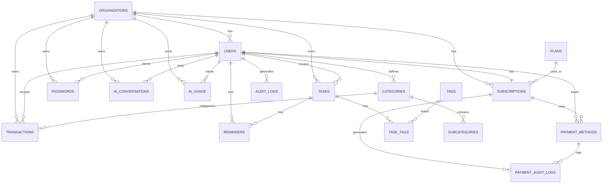

# Esquema de Base de Datos - TEMIS
## PostgreSQL 15.x Database Schema

---

## 1. Información General

- **Motor**: PostgreSQL 15.x
- **Instancia**: Amazon RDS (db.t4g.micro)
- **Charset**: UTF8
- **Collation**: es_ES.UTF-8 / en_US.UTF-8
- **Timezone**: UTC

### Extensiones Requeridas
```sql
CREATE EXTENSION IF NOT EXISTS "uuid-ossp";      -- Generación de UUIDs
CREATE EXTENSION IF NOT EXISTS "pgcrypto";        -- Funciones de encriptación
CREATE EXTENSION IF NOT EXISTS "pg_trgm";         -- Búsquedas fuzzy
```

---

## 2. Principios de Diseño

### 2.1 Multitenancy
- **Estrategia**: Shared database, shared schema con `organization_id`
- **Aislamiento**: Columna `organization_id` + `user_id` en todas las tablas de datos
- **Uso actual**: 1 usuario = 1 organización (personal)
- **Uso futuro**: Múltiples usuarios por organización (familias/equipos)
- **Seguridad**: Row-Level Security (RLS) policies obligatorias

### 2.2 Seguridad de Consultas
**CRÍTICO**: Todas las consultas DEBEN filtrar por:
```sql
WHERE organization_id = :org_id AND user_id = :user_id
```

### 2.3 Convenciones
- **IDs**: UUID v4 (uuid-ossp)
- **Timestamps**: `timestamp with time zone`
- **Soft Delete**: Columna `deleted_at` (nullable)
- **Auditoría**: `created_at`, `updated_at`
- **Nomenclatura**: snake_case para tablas y columnas

---

## 3. Diagrama Entidad-Relación



---

## 4. Tablas del Sistema

### 4.1 Tabla: `organizations`
Organizaciones del sistema (actualmente 1 org = 1 usuario).

```sql
CREATE TABLE organizations (
    id                  UUID PRIMARY KEY DEFAULT uuid_generate_v4(),
    name                VARCHAR(255) NOT NULL,
    slug                VARCHAR(100) NOT NULL UNIQUE,
    timezone            VARCHAR(50) DEFAULT 'UTC',
    locale              VARCHAR(10) DEFAULT 'es_ES',
    is_active           BOOLEAN DEFAULT true,
    metadata            JSONB DEFAULT '{}',
    created_at          TIMESTAMP WITH TIME ZONE DEFAULT CURRENT_TIMESTAMP,
    updated_at          TIMESTAMP WITH TIME ZONE DEFAULT CURRENT_TIMESTAMP,
    deleted_at          TIMESTAMP WITH TIME ZONE
);

-- Índices
CREATE INDEX idx_organizations_slug ON organizations(slug);
CREATE INDEX idx_organizations_is_active ON organizations(is_active);
CREATE INDEX idx_organizations_deleted_at ON organizations(deleted_at) WHERE deleted_at IS NULL;

COMMENT ON TABLE organizations IS 'Organizaciones - Actualmente 1 por usuario (uso personal), preparado para multiusuario futuro';
```

### 4.2 Tabla: `users`
Usuarios del sistema.

```sql
CREATE TABLE users (
    id                  UUID PRIMARY KEY DEFAULT uuid_generate_v4(),
    organization_id     UUID NOT NULL REFERENCES organizations(id) ON DELETE CASCADE,
    email               VARCHAR(255) NOT NULL UNIQUE,
    password_hash       VARCHAR(255) NOT NULL,
    name                VARCHAR(255) NOT NULL,
    avatar_url          TEXT,
    phone               VARCHAR(20),
    role                VARCHAR(50) NOT NULL DEFAULT 'user',
                        CHECK (role IN ('superadmin', 'admin', 'user')),
    is_active           BOOLEAN DEFAULT true,
    is_email_verified   BOOLEAN DEFAULT false,
    email_verified_at   TIMESTAMP WITH TIME ZONE,
    preferences         JSONB DEFAULT '{}',
    last_login_at       TIMESTAMP WITH TIME ZONE,
    password_changed_at TIMESTAMP WITH TIME ZONE,
    created_at          TIMESTAMP WITH TIME ZONE DEFAULT CURRENT_TIMESTAMP,
    updated_at          TIMESTAMP WITH TIME ZONE DEFAULT CURRENT_TIMESTAMP,
    deleted_at          TIMESTAMP WITH TIME ZONE
);

-- Índices
CREATE INDEX idx_users_organization_id ON users(organization_id);
CREATE INDEX idx_users_email ON users(email);
CREATE INDEX idx_users_role ON users(role);
CREATE INDEX idx_users_is_active ON users(is_active);

COMMENT ON COLUMN users.password_hash IS 'Hash bcrypt del password';
COMMENT ON TABLE users IS 'Usuarios - Autenticación JWT sin Cognito';
```

### 4.3 Tabla: `refresh_tokens`
Tokens de refresco para JWT.

```sql
CREATE TABLE refresh_tokens (
    id                  UUID PRIMARY KEY DEFAULT uuid_generate_v4(),
    organization_id     UUID NOT NULL REFERENCES organizations(id) ON DELETE CASCADE,
    user_id             UUID NOT NULL REFERENCES users(id) ON DELETE CASCADE,
    token_hash          VARCHAR(255) NOT NULL UNIQUE,
    device_id           VARCHAR(255),
    device_name         VARCHAR(255),
    ip_address          INET,
    user_agent          TEXT,
    expires_at          TIMESTAMP WITH TIME ZONE NOT NULL,
    is_revoked          BOOLEAN DEFAULT false,
    revoked_at          TIMESTAMP WITH TIME ZONE,
    created_at          TIMESTAMP WITH TIME ZONE DEFAULT CURRENT_TIMESTAMP
);

-- Índices
CREATE INDEX idx_refresh_tokens_organization_user ON refresh_tokens(organization_id, user_id);
CREATE INDEX idx_refresh_tokens_user_id ON refresh_tokens(user_id);
CREATE INDEX idx_refresh_tokens_token_hash ON refresh_tokens(token_hash);
CREATE INDEX idx_refresh_tokens_expires_at ON refresh_tokens(expires_at);

COMMENT ON TABLE refresh_tokens IS 'Tokens de refresco JWT para renovación de sesión - MULTITENANCY';
```

---

## 5. Módulo: Suscripciones

### 5.1 Tabla: `plans`
Planes de suscripción disponibles (tabla global).

```sql
CREATE TABLE plans (
    id                  UUID PRIMARY KEY DEFAULT uuid_generate_v4(),
    name                VARCHAR(100) NOT NULL UNIQUE,
    slug                VARCHAR(50) NOT NULL UNIQUE,
    description         TEXT,
    price_monthly       DECIMAL(10,2) NOT NULL DEFAULT 0.00,
    price_yearly        DECIMAL(10,2) NOT NULL DEFAULT 0.00,
    trial_days          INTEGER DEFAULT 14,
    max_users           INTEGER DEFAULT 1,
    is_active           BOOLEAN DEFAULT true,
    features            JSONB DEFAULT '{}',
    sort_order          INTEGER DEFAULT 0,
    created_at          TIMESTAMP WITH TIME ZONE DEFAULT CURRENT_TIMESTAMP,
    updated_at          TIMESTAMP WITH TIME ZONE DEFAULT CURRENT_TIMESTAMP
);

-- Índices
CREATE INDEX idx_plans_slug ON plans(slug);
CREATE INDEX idx_plans_is_active ON plans(is_active);

-- Datos iniciales
INSERT INTO plans (name, slug, price_monthly, price_yearly, max_users, features) VALUES
('Free', 'free', 0.00, 0.00, 1, '{"tasks": true, "passwords": false, "finance": false}'),
('Basic', 'basic', 4.99, 49.90, 1, '{"tasks": true, "passwords": true, "finance": false}'),
('Pro', 'pro', 9.99, 99.90, 1, '{"tasks": true, "passwords": true, "finance": true, "voice_input": true}'),
('Premium', 'premium', 19.99, 199.90, 1, '{"tasks": true, "passwords": true, "finance": true, "voice_input": true, "advanced_reports": true, "sms_capture": true}');

COMMENT ON TABLE plans IS 'Planes de suscripción - Tabla global sin organization_id';
```

### 5.2 Tabla: `subscriptions`
Suscripciones de usuarios (1 por usuario actualmente).

```sql
CREATE TABLE subscriptions (
    id                  UUID PRIMARY KEY DEFAULT uuid_generate_v4(),
    organization_id     UUID NOT NULL REFERENCES organizations(id) ON DELETE CASCADE,
    user_id             UUID NOT NULL REFERENCES users(id) ON DELETE CASCADE,
    plan_id             UUID NOT NULL REFERENCES plans(id),
    payment_method_id   UUID REFERENCES payment_methods(id) ON DELETE SET NULL,
    status              VARCHAR(50) NOT NULL DEFAULT 'trial',
                        CHECK (status IN ('trial', 'active', 'past_due', 'cancelled', 'expired', 'suspended')),
    billing_cycle       VARCHAR(20) NOT NULL DEFAULT 'monthly',
                        CHECK (billing_cycle IN ('monthly', 'yearly')),
    start_date          TIMESTAMP WITH TIME ZONE NOT NULL,
    end_date            TIMESTAMP WITH TIME ZONE,
    trial_ends_at       TIMESTAMP WITH TIME ZONE,
    cancelled_at        TIMESTAMP WITH TIME ZONE,
    next_billing_date   TIMESTAMP WITH TIME ZONE,
    expiry_notified_at  TIMESTAMP WITH TIME ZONE,
    payment_provider    VARCHAR(50) DEFAULT 'wompi',
    payment_id          VARCHAR(255),
    metadata            JSONB DEFAULT '{}',
    created_at          TIMESTAMP WITH TIME ZONE DEFAULT CURRENT_TIMESTAMP,
    updated_at          TIMESTAMP WITH TIME ZONE DEFAULT CURRENT_TIMESTAMP
);

-- Índices
CREATE INDEX idx_subscriptions_organization_user ON subscriptions(organization_id, user_id);
CREATE INDEX idx_subscriptions_organization_id ON subscriptions(organization_id);
CREATE INDEX idx_subscriptions_user_id ON subscriptions(user_id);
CREATE INDEX idx_subscriptions_plan_id ON subscriptions(plan_id);
CREATE INDEX idx_subscriptions_payment_method_id ON subscriptions(payment_method_id);
CREATE INDEX idx_subscriptions_status ON subscriptions(status);
CREATE INDEX idx_subscriptions_org_user_status ON subscriptions(organization_id, user_id, status);
CREATE INDEX idx_subscriptions_end_date ON subscriptions(end_date);
CREATE INDEX idx_subscriptions_next_billing_date ON subscriptions(next_billing_date);

COMMENT ON TABLE subscriptions IS 'Suscripciones - Actualmente 1 por usuario (uso personal) - MULTITENANCY';
COMMENT ON COLUMN subscriptions.payment_method_id IS 'Método de pago guardado para renovación automática';
COMMENT ON COLUMN subscriptions.expiry_notified_at IS 'Fecha cuando se envió notificación de vencimiento (5 días antes)';
```

### 5.3 Tabla: `payment_methods`
Métodos de pago guardados para renovación automática (tokenizados por Wompi).

```sql
CREATE TABLE payment_methods (
    id                      UUID PRIMARY KEY DEFAULT uuid_generate_v4(),
    organization_id         UUID NOT NULL REFERENCES organizations(id) ON DELETE CASCADE,
    user_id                 UUID NOT NULL REFERENCES users(id) ON DELETE CASCADE,
    wompi_payment_source_id VARCHAR(255) NOT NULL UNIQUE,
    card_brand              VARCHAR(50),
    last_four_digits        VARCHAR(4) NOT NULL,
    expiry_month            INTEGER NOT NULL CHECK (expiry_month BETWEEN 1 AND 12),
    expiry_year             INTEGER NOT NULL,
    cardholder_name         VARCHAR(255),
    is_default              BOOLEAN DEFAULT false,
    is_active               BOOLEAN DEFAULT true,
    metadata                JSONB DEFAULT '{}',
    created_at              TIMESTAMP WITH TIME ZONE DEFAULT CURRENT_TIMESTAMP,
    updated_at              TIMESTAMP WITH TIME ZONE DEFAULT CURRENT_TIMESTAMP,
    deleted_at              TIMESTAMP WITH TIME ZONE
);

-- Índices
CREATE INDEX idx_payment_methods_organization_user ON payment_methods(organization_id, user_id);
CREATE INDEX idx_payment_methods_wompi_source ON payment_methods(wompi_payment_source_id);
CREATE INDEX idx_payment_methods_is_default ON payment_methods(is_default);
CREATE INDEX idx_payment_methods_deleted_at ON payment_methods(deleted_at) WHERE deleted_at IS NULL;

COMMENT ON TABLE payment_methods IS 'Métodos de pago tokenizados - NUNCA almacenar número completo de tarjeta ni CVV';
COMMENT ON COLUMN payment_methods.wompi_payment_source_id IS 'ID del payment source en Wompi (token seguro)';
```

### 5.4 Tabla: `payment_audit_logs`
Auditoría completa de eventos de pago.

```sql
CREATE TABLE payment_audit_logs (
    id                  UUID PRIMARY KEY DEFAULT uuid_generate_v4(),
    organization_id     UUID NOT NULL REFERENCES organizations(id) ON DELETE CASCADE,
    user_id             UUID NOT NULL REFERENCES users(id) ON DELETE CASCADE,
    subscription_id     UUID REFERENCES subscriptions(id) ON DELETE SET NULL,
    payment_method_id   UUID REFERENCES payment_methods(id) ON DELETE SET NULL,
    event_type          VARCHAR(100) NOT NULL,
                        CHECK (event_type IN (
                            'payment_initiated', 'payment_success', 'payment_failed',
                            'payment_refunded', 'payment_method_added', 'payment_method_removed',
                            'subscription_created', 'subscription_renewed', 'subscription_cancelled',
                            'subscription_expired', 'plan_changed', 'webhook_received'
                        )),
    amount              DECIMAL(10,2),
    currency            VARCHAR(3) DEFAULT 'COP',
    wompi_transaction_id VARCHAR(255),
    wompi_status        VARCHAR(50),
    status_message      TEXT,
    metadata            JSONB DEFAULT '{}',
    ip_address          INET,
    user_agent          TEXT,
    created_at          TIMESTAMP WITH TIME ZONE DEFAULT CURRENT_TIMESTAMP
);

-- Índices
CREATE INDEX idx_payment_audit_organization_user ON payment_audit_logs(organization_id, user_id);
CREATE INDEX idx_payment_audit_subscription_id ON payment_audit_logs(subscription_id);
CREATE INDEX idx_payment_audit_event_type ON payment_audit_logs(event_type);
CREATE INDEX idx_payment_audit_wompi_transaction ON payment_audit_logs(wompi_transaction_id);
CREATE INDEX idx_payment_audit_created_at ON payment_audit_logs(created_at DESC);

COMMENT ON TABLE payment_audit_logs IS 'Auditoría de pagos - Log completo de todos los eventos de pago y suscripciones';
```

---

## 6. Módulo: Tareas y Calendario

### 6.1 Tabla: `tasks`
Tareas del usuario.

```sql
CREATE TABLE tasks (
    id                  UUID PRIMARY KEY DEFAULT uuid_generate_v4(),
    organization_id     UUID NOT NULL REFERENCES organizations(id) ON DELETE CASCADE,
    user_id             UUID NOT NULL REFERENCES users(id) ON DELETE CASCADE,
    title               VARCHAR(500) NOT NULL,
    description         TEXT,
    status              VARCHAR(50) NOT NULL DEFAULT 'pending',
                        CHECK (status IN ('pending', 'in_progress', 'completed', 'cancelled')),
    priority            VARCHAR(20) DEFAULT 'medium',
                        CHECK (priority IN ('low', 'medium', 'high', 'urgent')),
    due_date            TIMESTAMP WITH TIME ZONE,
    completed_at        TIMESTAMP WITH TIME ZONE,
    is_all_day          BOOLEAN DEFAULT false,
    recurrence_rule     VARCHAR(255),
    parent_task_id      UUID REFERENCES tasks(id) ON DELETE CASCADE,
    sort_order          INTEGER DEFAULT 0,
    metadata            JSONB DEFAULT '{}',
    created_at          TIMESTAMP WITH TIME ZONE DEFAULT CURRENT_TIMESTAMP,
    updated_at          TIMESTAMP WITH TIME ZONE DEFAULT CURRENT_TIMESTAMP,
    deleted_at          TIMESTAMP WITH TIME ZONE
);

-- Índices
CREATE INDEX idx_tasks_organization_user ON tasks(organization_id, user_id);
CREATE INDEX idx_tasks_user_id ON tasks(user_id);
CREATE INDEX idx_tasks_status ON tasks(status);
CREATE INDEX idx_tasks_priority ON tasks(priority);
CREATE INDEX idx_tasks_due_date ON tasks(due_date);
CREATE INDEX idx_tasks_created_at ON tasks(created_at DESC);
CREATE INDEX idx_tasks_deleted_at ON tasks(deleted_at) WHERE deleted_at IS NULL;

-- Índice de búsqueda de texto completo
CREATE INDEX idx_tasks_search ON tasks USING gin(to_tsvector('spanish', coalesce(title, '') || ' ' || coalesce(description, '')));

COMMENT ON TABLE tasks IS 'Tareas de usuario - DEBE filtrar por organization_id AND user_id';
```

### 6.2 Tabla: `tags`
Etiquetas para categorizar tareas.

```sql
CREATE TABLE tags (
    id                  UUID PRIMARY KEY DEFAULT uuid_generate_v4(),
    organization_id     UUID NOT NULL REFERENCES organizations(id) ON DELETE CASCADE,
    user_id             UUID NOT NULL REFERENCES users(id) ON DELETE CASCADE,
    name                VARCHAR(100) NOT NULL,
    color               VARCHAR(7) DEFAULT '#3B82F6',
    created_at          TIMESTAMP WITH TIME ZONE DEFAULT CURRENT_TIMESTAMP,
    UNIQUE(organization_id, user_id, name)
);

CREATE INDEX idx_tags_organization_user ON tags(organization_id, user_id);

COMMENT ON TABLE tags IS 'Etiquetas de tareas - DEBE filtrar por organization_id AND user_id';
```

### 6.3 Tabla: `task_tags`
Relación muchos a muchos entre tareas y etiquetas.

```sql
CREATE TABLE task_tags (
    organization_id     UUID NOT NULL REFERENCES organizations(id) ON DELETE CASCADE,
    user_id             UUID NOT NULL REFERENCES users(id) ON DELETE CASCADE,
    task_id             UUID NOT NULL REFERENCES tasks(id) ON DELETE CASCADE,
    tag_id              UUID NOT NULL REFERENCES tags(id) ON DELETE CASCADE,
    created_at          TIMESTAMP WITH TIME ZONE DEFAULT CURRENT_TIMESTAMP,
    PRIMARY KEY (task_id, tag_id)
);

CREATE INDEX idx_task_tags_organization_user ON task_tags(organization_id, user_id);
CREATE INDEX idx_task_tags_task_id ON task_tags(task_id);
CREATE INDEX idx_task_tags_tag_id ON task_tags(tag_id);

COMMENT ON TABLE task_tags IS 'Relación Tareas-Etiquetas - MULTITENANCY para performance';
```

### 6.4 Tabla: `reminders`
Recordatorios para tareas.

```sql
CREATE TABLE reminders (
    id                  UUID PRIMARY KEY DEFAULT uuid_generate_v4(),
    organization_id     UUID NOT NULL REFERENCES organizations(id) ON DELETE CASCADE,
    user_id             UUID NOT NULL REFERENCES users(id) ON DELETE CASCADE,
    task_id             UUID REFERENCES tasks(id) ON DELETE CASCADE,
    title               VARCHAR(500) NOT NULL,
    message             TEXT,
    remind_at           TIMESTAMP WITH TIME ZONE NOT NULL,
    is_sent             BOOLEAN DEFAULT false,
    sent_at             TIMESTAMP WITH TIME ZONE,
    notification_type   VARCHAR(50) DEFAULT 'push',
                        CHECK (notification_type IN ('push', 'email', 'both')),
    created_at          TIMESTAMP WITH TIME ZONE DEFAULT CURRENT_TIMESTAMP,
    updated_at          TIMESTAMP WITH TIME ZONE DEFAULT CURRENT_TIMESTAMP
);

-- Índices
CREATE INDEX idx_reminders_organization_user ON reminders(organization_id, user_id);
CREATE INDEX idx_reminders_task_id ON reminders(task_id);
CREATE INDEX idx_reminders_remind_at ON reminders(remind_at);
CREATE INDEX idx_reminders_is_sent ON reminders(is_sent) WHERE is_sent = false;

COMMENT ON TABLE reminders IS 'Recordatorios - DEBE filtrar por organization_id AND user_id';
```

---

## 7. Módulo: Gestor de Contraseñas

### 7.1 Tabla: `passwords`
Almacenamiento seguro de contraseñas.

```sql
CREATE TABLE passwords (
    id                  UUID PRIMARY KEY DEFAULT uuid_generate_v4(),
    organization_id     UUID NOT NULL REFERENCES organizations(id) ON DELETE CASCADE,
    user_id             UUID NOT NULL REFERENCES users(id) ON DELETE CASCADE,
    name                VARCHAR(255) NOT NULL,
    username            VARCHAR(255),
    encrypted_password  BYTEA NOT NULL,
    encryption_iv       BYTEA NOT NULL,
    url                 TEXT,
    notes               TEXT,
    category            VARCHAR(50) DEFAULT 'other',
                        CHECK (category IN ('website', 'bank', 'wifi', 'email', 'app', 'other')),
    tags                TEXT[],
    last_used_at        TIMESTAMP WITH TIME ZONE,
    expires_at          TIMESTAMP WITH TIME ZONE,
    is_favorite         BOOLEAN DEFAULT false,
    metadata            JSONB DEFAULT '{}',
    created_at          TIMESTAMP WITH TIME ZONE DEFAULT CURRENT_TIMESTAMP,
    updated_at          TIMESTAMP WITH TIME ZONE DEFAULT CURRENT_TIMESTAMP,
    deleted_at          TIMESTAMP WITH TIME ZONE
);

-- Índices
CREATE INDEX idx_passwords_organization_user ON passwords(organization_id, user_id);
CREATE INDEX idx_passwords_category ON passwords(category);
CREATE INDEX idx_passwords_is_favorite ON passwords(is_favorite);
CREATE INDEX idx_passwords_deleted_at ON passwords(deleted_at) WHERE deleted_at IS NULL;
CREATE INDEX idx_passwords_search ON passwords USING gin(to_tsvector('spanish', coalesce(name, '') || ' ' || coalesce(username, '')));

COMMENT ON TABLE passwords IS 'Contraseñas encriptadas - DEBE filtrar por organization_id AND user_id';
COMMENT ON COLUMN passwords.encrypted_password IS 'Password encriptado con AES-256-GCM';
COMMENT ON COLUMN passwords.encryption_iv IS 'Initialization Vector único por registro';
```

---

## 8. Módulo: Finanzas Personales

### 8.1 Tabla: `categories`
Categorías de transacciones.

```sql
CREATE TABLE categories (
    id                  UUID PRIMARY KEY DEFAULT uuid_generate_v4(),
    organization_id     UUID REFERENCES organizations(id) ON DELETE CASCADE,
    user_id             UUID REFERENCES users(id) ON DELETE CASCADE,
    name                VARCHAR(100) NOT NULL,
    type                VARCHAR(20) NOT NULL,
                        CHECK (type IN ('income', 'expense')),
    icon                VARCHAR(50),
    color               VARCHAR(7) DEFAULT '#6B7280',
    is_default          BOOLEAN DEFAULT false,
    is_active           BOOLEAN DEFAULT true,
    sort_order          INTEGER DEFAULT 0,
    parent_category_id  UUID REFERENCES categories(id) ON DELETE CASCADE,
    created_at          TIMESTAMP WITH TIME ZONE DEFAULT CURRENT_TIMESTAMP,
    updated_at          TIMESTAMP WITH TIME ZONE DEFAULT CURRENT_TIMESTAMP
);

-- Índices
CREATE INDEX idx_categories_organization_user ON categories(organization_id, user_id);
CREATE INDEX idx_categories_type ON categories(type);
CREATE INDEX idx_categories_parent_id ON categories(parent_category_id);

-- Categorías por defecto (sin organization_id ni user_id = globales)
INSERT INTO categories (name, type, icon, is_default) VALUES
('Salario', 'income', '💰', true),
('Freelance', 'income', '💼', true),
('Inversiones', 'income', '📈', true),
('Otros Ingresos', 'income', '💵', true),
('Alimentación', 'expense', '🍔', true),
('Transporte', 'expense', '🚗', true),
('Entretenimiento', 'expense', '🎬', true),
('Servicios', 'expense', '💡', true),
('Salud', 'expense', '⚕️', true),
('Educación', 'expense', '📚', true),
('Vivienda', 'expense', '🏠', true),
('Ropa', 'expense', '👕', true),
('Otros Gastos', 'expense', '💳', true);

COMMENT ON TABLE categories IS 'Categorías - Globales (is_default=true) o por usuario';
```

### 8.2 Tabla: `transactions`
Transacciones financieras.

```sql
CREATE TABLE transactions (
    id                  UUID PRIMARY KEY DEFAULT uuid_generate_v4(),
    organization_id     UUID NOT NULL REFERENCES organizations(id) ON DELETE CASCADE,
    user_id             UUID NOT NULL REFERENCES users(id) ON DELETE CASCADE,
    category_id         UUID REFERENCES categories(id) ON DELETE SET NULL,
    type                VARCHAR(20) NOT NULL,
                        CHECK (type IN ('income', 'expense')),
    amount              DECIMAL(15,2) NOT NULL CHECK (amount > 0),
    currency            VARCHAR(3) DEFAULT 'USD',
    description         TEXT,
    transaction_date    TIMESTAMP WITH TIME ZONE NOT NULL,
    source              VARCHAR(50) DEFAULT 'manual',
                        CHECK (source IN ('manual', 'voice', 'sms', 'import')),
    source_reference    VARCHAR(255),
    payment_method      VARCHAR(50),
                        CHECK (payment_method IN ('cash', 'credit_card', 'debit_card', 'transfer', 'other')),
    tags                TEXT[],
    location            VARCHAR(255),
    is_recurring        BOOLEAN DEFAULT false,
    recurrence_rule     VARCHAR(255),
    metadata            JSONB DEFAULT '{}',
    created_at          TIMESTAMP WITH TIME ZONE DEFAULT CURRENT_TIMESTAMP,
    updated_at          TIMESTAMP WITH TIME ZONE DEFAULT CURRENT_TIMESTAMP,
    deleted_at          TIMESTAMP WITH TIME ZONE
);

-- Índices
CREATE INDEX idx_transactions_organization_user ON transactions(organization_id, user_id);
CREATE INDEX idx_transactions_category_id ON transactions(category_id);
CREATE INDEX idx_transactions_type ON transactions(type);
CREATE INDEX idx_transactions_transaction_date ON transactions(transaction_date DESC);
CREATE INDEX idx_transactions_source ON transactions(source);
CREATE INDEX idx_transactions_deleted_at ON transactions(deleted_at) WHERE deleted_at IS NULL;
CREATE INDEX idx_transactions_search ON transactions USING gin(to_tsvector('spanish', coalesce(description, '')));

COMMENT ON TABLE transactions IS 'Transacciones financieras - DEBE filtrar por organization_id AND user_id';
```

### 8.3 Tabla: `sms_messages`
Mensajes SMS bancarios capturados.

```sql
CREATE TABLE sms_messages (
    id                  UUID PRIMARY KEY DEFAULT uuid_generate_v4(),
    organization_id     UUID NOT NULL REFERENCES organizations(id) ON DELETE CASCADE,
    user_id             UUID NOT NULL REFERENCES users(id) ON DELETE CASCADE,
    transaction_id      UUID REFERENCES transactions(id) ON DELETE SET NULL,
    sender              VARCHAR(50) NOT NULL,
    message_body        TEXT NOT NULL,
    received_at         TIMESTAMP WITH TIME ZONE NOT NULL,
    is_processed        BOOLEAN DEFAULT false,
    processed_at        TIMESTAMP WITH TIME ZONE,
    parsed_data         JSONB,
    error_message       TEXT,
    created_at          TIMESTAMP WITH TIME ZONE DEFAULT CURRENT_TIMESTAMP
);

-- Índices
CREATE INDEX idx_sms_messages_organization_user ON sms_messages(organization_id, user_id);
CREATE INDEX idx_sms_messages_transaction_id ON sms_messages(transaction_id);
CREATE INDEX idx_sms_messages_is_processed ON sms_messages(is_processed);
CREATE INDEX idx_sms_messages_received_at ON sms_messages(received_at DESC);

COMMENT ON TABLE sms_messages IS 'SMS bancarios capturados - DEBE filtrar por organization_id AND user_id';
```

### 8.4 Tabla: `budgets`
Presupuestos mensuales.

```sql
CREATE TABLE budgets (
    id                  UUID PRIMARY KEY DEFAULT uuid_generate_v4(),
    organization_id     UUID NOT NULL REFERENCES organizations(id) ON DELETE CASCADE,
    user_id             UUID NOT NULL REFERENCES users(id) ON DELETE CASCADE,
    category_id         UUID REFERENCES categories(id) ON DELETE CASCADE,
    name                VARCHAR(255) NOT NULL,
    amount              DECIMAL(15,2) NOT NULL CHECK (amount > 0),
    period              VARCHAR(20) DEFAULT 'monthly',
                        CHECK (period IN ('weekly', 'monthly', 'yearly')),
    start_date          DATE NOT NULL,
    end_date            DATE,
    is_active           BOOLEAN DEFAULT true,
    alert_threshold     INTEGER DEFAULT 80 CHECK (alert_threshold BETWEEN 0 AND 100),
    created_at          TIMESTAMP WITH TIME ZONE DEFAULT CURRENT_TIMESTAMP,
    updated_at          TIMESTAMP WITH TIME ZONE DEFAULT CURRENT_TIMESTAMP
);

-- Índices
CREATE INDEX idx_budgets_organization_user ON budgets(organization_id, user_id);
CREATE INDEX idx_budgets_category_id ON budgets(category_id);
CREATE INDEX idx_budgets_is_active ON budgets(is_active);

COMMENT ON TABLE budgets IS 'Presupuestos - DEBE filtrar por organization_id AND user_id';
```

---

## 9. Módulo: Asistente IA

### 9.1 Tabla: `ai_conversations`
Historial de conversaciones con el asistente IA.

```sql
CREATE TABLE ai_conversations (
    id                  UUID PRIMARY KEY DEFAULT uuid_generate_v4(),
    organization_id     UUID NOT NULL REFERENCES organizations(id) ON DELETE CASCADE,
    user_id             UUID NOT NULL REFERENCES users(id) ON DELETE CASCADE,
    conversation_id     UUID NOT NULL,
    message_type        VARCHAR(20) NOT NULL CHECK (message_type IN ('user', 'assistant')),
    message_content     TEXT NOT NULL,
    model_used          VARCHAR(100) DEFAULT 'claude-3-5-sonnet-20241022',
    tokens_input        INTEGER DEFAULT 0,
    tokens_output       INTEGER DEFAULT 0,
    cost_usd            DECIMAL(10,6) DEFAULT 0.000000,
    feature_type        VARCHAR(50) NOT NULL,
                        CHECK (feature_type IN ('chat', 'voice_task', 'voice_finance', 'insight', 'prediction', 'summary')),
    metadata            JSONB DEFAULT '{}',
    created_at          TIMESTAMP WITH TIME ZONE DEFAULT CURRENT_TIMESTAMP
);

-- Índices
CREATE INDEX idx_ai_conversations_organization_user ON ai_conversations(organization_id, user_id);
CREATE INDEX idx_ai_conversations_conversation_id ON ai_conversations(conversation_id);
CREATE INDEX idx_ai_conversations_feature_type ON ai_conversations(feature_type);
CREATE INDEX idx_ai_conversations_created_at ON ai_conversations(created_at DESC);
CREATE INDEX idx_ai_conversations_user_date ON ai_conversations(user_id, created_at DESC);

COMMENT ON TABLE ai_conversations IS 'Historial de conversaciones IA - DEBE filtrar por organization_id AND user_id';
COMMENT ON COLUMN ai_conversations.conversation_id IS 'ID de conversación para agrupar mensajes relacionados';
COMMENT ON COLUMN ai_conversations.cost_usd IS 'Costo calculado: (tokens_input * $0.003 + tokens_output * $0.015) / 1000';
```

### 9.2 Tabla: `ai_usage`
Control de cuotas de uso de IA por usuario.

```sql
CREATE TABLE ai_usage (
    id                  UUID PRIMARY KEY DEFAULT uuid_generate_v4(),
    organization_id     UUID NOT NULL REFERENCES organizations(id) ON DELETE CASCADE,
    user_id             UUID NOT NULL REFERENCES users(id) ON DELETE CASCADE,
    feature_type        VARCHAR(50) NOT NULL,
                        CHECK (feature_type IN ('chat', 'voice_task', 'voice_finance', 'insight', 'prediction', 'summary')),
    month_year          VARCHAR(7) NOT NULL,
    usage_count         INTEGER NOT NULL DEFAULT 0,
    tokens_consumed     INTEGER DEFAULT 0,
    cost_usd            DECIMAL(10,6) DEFAULT 0.000000,
    plan_limit          INTEGER,
    created_at          TIMESTAMP WITH TIME ZONE DEFAULT CURRENT_TIMESTAMP,
    updated_at          TIMESTAMP WITH TIME ZONE DEFAULT CURRENT_TIMESTAMP,
    UNIQUE(organization_id, user_id, feature_type, month_year)
);

-- Índices
CREATE INDEX idx_ai_usage_organization_user ON ai_usage(organization_id, user_id);
CREATE INDEX idx_ai_usage_feature_month ON ai_usage(feature_type, month_year);
CREATE INDEX idx_ai_usage_user_month ON ai_usage(user_id, month_year);

COMMENT ON TABLE ai_usage IS 'Seguimiento de cuotas IA mensual - DEBE filtrar por organization_id AND user_id';
COMMENT ON COLUMN ai_usage.month_year IS 'Formato YYYY-MM (ej: 2026-07)';
COMMENT ON COLUMN ai_usage.plan_limit IS 'Límite del plan al momento del uso (guardado para histórico)';
```

---

## 10. Auditoría y Logs

### 10.1 Tabla: `audit_logs`
Registro de auditoría del sistema.

```sql
CREATE TABLE audit_logs (
    id                  UUID PRIMARY KEY DEFAULT uuid_generate_v4(),
    organization_id     UUID REFERENCES organizations(id) ON DELETE CASCADE,
    user_id             UUID REFERENCES users(id) ON DELETE SET NULL,
    action              VARCHAR(100) NOT NULL,
    entity_type         VARCHAR(100) NOT NULL,
    entity_id           UUID,
    old_values          JSONB,
    new_values          JSONB,
    ip_address          INET,
    user_agent          TEXT,
    metadata            JSONB DEFAULT '{}',
    created_at          TIMESTAMP WITH TIME ZONE DEFAULT CURRENT_TIMESTAMP
);

-- Índices
CREATE INDEX idx_audit_logs_organization_user ON audit_logs(organization_id, user_id);
CREATE INDEX idx_audit_logs_entity_type ON audit_logs(entity_type);
CREATE INDEX idx_audit_logs_entity_id ON audit_logs(entity_id);
CREATE INDEX idx_audit_logs_created_at ON audit_logs(created_at DESC);

COMMENT ON TABLE audit_logs IS 'Logs de auditoría - Registra todas las acciones importantes';
```

---

## 11. Row-Level Security (RLS)

### 11.1 Habilitar RLS en tablas principales

```sql
-- Habilitar RLS en TODAS las tablas de datos de usuario
ALTER TABLE tasks ENABLE ROW LEVEL SECURITY;
ALTER TABLE passwords ENABLE ROW LEVEL SECURITY;
ALTER TABLE transactions ENABLE ROW LEVEL SECURITY;
ALTER TABLE sms_messages ENABLE ROW LEVEL SECURITY;
ALTER TABLE budgets ENABLE ROW LEVEL SECURITY;
ALTER TABLE reminders ENABLE ROW LEVEL SECURITY;
ALTER TABLE tags ENABLE ROW LEVEL SECURITY;
ALTER TABLE task_tags ENABLE ROW LEVEL SECURITY;
ALTER TABLE categories ENABLE ROW LEVEL SECURITY;
ALTER TABLE ai_conversations ENABLE ROW LEVEL SECURITY;
ALTER TABLE ai_usage ENABLE ROW LEVEL SECURITY;
ALTER TABLE payment_methods ENABLE ROW LEVEL SECURITY;
ALTER TABLE payment_audit_logs ENABLE ROW LEVEL SECURITY;
ALTER TABLE subscriptions ENABLE ROW LEVEL SECURITY;
ALTER TABLE refresh_tokens ENABLE ROW LEVEL SECURITY;
ALTER TABLE audit_logs ENABLE ROW LEVEL SECURITY;

-- Policy para tareas: OBLIGATORIO filtrar por organization_id Y user_id
CREATE POLICY tasks_isolation_policy ON tasks
    FOR ALL
    USING (
        organization_id = current_setting('app.current_organization_id')::uuid
        AND user_id = current_setting('app.current_user_id')::uuid
    );

-- Policy para contraseñas
CREATE POLICY passwords_isolation_policy ON passwords
    FOR ALL
    USING (
        organization_id = current_setting('app.current_organization_id')::uuid
        AND user_id = current_setting('app.current_user_id')::uuid
    );

-- Policy para transacciones
CREATE POLICY transactions_isolation_policy ON transactions
    FOR ALL
    USING (
        organization_id = current_setting('app.current_organization_id')::uuid
        AND user_id = current_setting('app.current_user_id')::uuid
    );

-- Policy para SMS
CREATE POLICY sms_messages_isolation_policy ON sms_messages
    FOR ALL
    USING (
        organization_id = current_setting('app.current_organization_id')::uuid
        AND user_id = current_setting('app.current_user_id')::uuid
    );

-- Policy para presupuestos
CREATE POLICY budgets_isolation_policy ON budgets
    FOR ALL
    USING (
        organization_id = current_setting('app.current_organization_id')::uuid
        AND user_id = current_setting('app.current_user_id')::uuid
    );

-- Policy para recordatorios
CREATE POLICY reminders_isolation_policy ON reminders
    FOR ALL
    USING (
        organization_id = current_setting('app.current_organization_id')::uuid
        AND user_id = current_setting('app.current_user_id')::uuid
    );

-- Policy para etiquetas
CREATE POLICY tags_isolation_policy ON tags
    FOR ALL
    USING (
        organization_id = current_setting('app.current_organization_id')::uuid
        AND user_id = current_setting('app.current_user_id')::uuid
    );

-- Policy para conversaciones IA
CREATE POLICY ai_conversations_isolation_policy ON ai_conversations
    FOR ALL
    USING (
        organization_id = current_setting('app.current_organization_id')::uuid
        AND user_id = current_setting('app.current_user_id')::uuid
    );

-- Policy para uso de IA
CREATE POLICY ai_usage_isolation_policy ON ai_usage
    FOR ALL
    USING (
        organization_id = current_setting('app.current_organization_id')::uuid
        AND user_id = current_setting('app.current_user_id')::uuid
    );

-- Policy para métodos de pago
CREATE POLICY payment_methods_isolation_policy ON payment_methods
    FOR ALL
    USING (
        organization_id = current_setting('app.current_organization_id')::uuid
        AND user_id = current_setting('app.current_user_id')::uuid
    );

-- Policy para auditoría de pagos
CREATE POLICY payment_audit_logs_isolation_policy ON payment_audit_logs
    FOR ALL
    USING (
        organization_id = current_setting('app.current_organization_id')::uuid
        AND user_id = current_setting('app.current_user_id')::uuid
    );

-- Policy para subscriptions
CREATE POLICY subscriptions_isolation_policy ON subscriptions
    FOR ALL
    USING (
        organization_id::TEXT = current_setting('app.current_organization_id', TRUE)
        AND user_id::TEXT = current_setting('app.current_user_id', TRUE)
    );

COMMENT ON POLICY subscriptions_isolation_policy ON subscriptions IS
    'RLS: Solo acceso a suscripciones de la organización y usuario actual';

-- Policy para categories (permite acceso a categorías globales O propias)
CREATE POLICY categories_isolation_policy ON categories
    FOR ALL
    USING (
        -- Categorías globales (accesibles por todos)
        (organization_id IS NULL AND user_id IS NULL AND is_default = true)
        OR
        -- Categorías del usuario actual
        (
            organization_id::TEXT = current_setting('app.current_organization_id', TRUE)
            AND user_id::TEXT = current_setting('app.current_user_id', TRUE)
        )
    );

COMMENT ON POLICY categories_isolation_policy ON categories IS
    'RLS: Acceso a categorías globales O categorías del usuario';

-- Policy para refresh_tokens
CREATE POLICY refresh_tokens_isolation_policy ON refresh_tokens
    FOR ALL
    USING (
        organization_id::TEXT = current_setting('app.current_organization_id', TRUE)
        AND user_id::TEXT = current_setting('app.current_user_id', TRUE)
    );

COMMENT ON POLICY refresh_tokens_isolation_policy ON refresh_tokens IS
    'RLS: Solo acceso a tokens de la organización y usuario actual';

-- Policy para task_tags
CREATE POLICY task_tags_isolation_policy ON task_tags
    FOR ALL
    USING (
        organization_id::TEXT = current_setting('app.current_organization_id', TRUE)
        AND user_id::TEXT = current_setting('app.current_user_id', TRUE)
    );

COMMENT ON POLICY task_tags_isolation_policy ON task_tags IS
    'RLS: Solo acceso a relaciones tarea-etiqueta del usuario';

-- Policy para audit_logs (SELECT - permite ver logs del usuario O del sistema si es superadmin)
CREATE POLICY audit_logs_select_policy ON audit_logs
    FOR SELECT
    USING (
        -- Logs del usuario
        (
            organization_id::TEXT = current_setting('app.current_organization_id', TRUE)
            AND user_id::TEXT = current_setting('app.current_user_id', TRUE)
        )
        OR
        -- Logs del sistema (sin user_id, solo superadmins pueden ver)
        (
            user_id IS NULL
            AND current_setting('app.current_user_role', TRUE) = 'superadmin'
        )
    );

-- Policy para audit_logs (INSERT - permite insertar cualquier log, backend controla)
CREATE POLICY audit_logs_insert_policy ON audit_logs
    FOR INSERT
    WITH CHECK (true);

COMMENT ON POLICY audit_logs_select_policy ON audit_logs IS
    'RLS SELECT: Ver logs del usuario O logs del sistema (superadmins)';
COMMENT ON POLICY audit_logs_insert_policy ON audit_logs IS
    'RLS INSERT: Backend puede insertar cualquier log sin restricción';
```

### 11.2 Uso de RLS desde Lambda

En cada Lambda function, después de validar el JWT:

```javascript
// Establecer contexto de usuario antes de cualquier query
await db.query(`
  SET app.current_organization_id = $1;
  SET app.current_user_id = $2;
`, [organizationId, userId]);

// Ahora todas las queries están protegidas por RLS
const tasks = await db.query('SELECT * FROM tasks WHERE status = $1', ['pending']);
// RLS automáticamente agrega: AND organization_id = X AND user_id = Y
```

---

## 12. Funciones y Triggers

### 12.1 Trigger: Actualizar `updated_at`

```sql
CREATE OR REPLACE FUNCTION update_updated_at_column()
RETURNS TRIGGER AS $$
BEGIN
    NEW.updated_at = CURRENT_TIMESTAMP;
    RETURN NEW;
END;
$$ LANGUAGE plpgsql;

-- Aplicar a todas las tablas con updated_at
CREATE TRIGGER update_organizations_updated_at BEFORE UPDATE ON organizations
    FOR EACH ROW EXECUTE FUNCTION update_updated_at_column();

CREATE TRIGGER update_users_updated_at BEFORE UPDATE ON users
    FOR EACH ROW EXECUTE FUNCTION update_updated_at_column();

CREATE TRIGGER update_tasks_updated_at BEFORE UPDATE ON tasks
    FOR EACH ROW EXECUTE FUNCTION update_updated_at_column();

CREATE TRIGGER update_passwords_updated_at BEFORE UPDATE ON passwords
    FOR EACH ROW EXECUTE FUNCTION update_updated_at_column();

CREATE TRIGGER update_transactions_updated_at BEFORE UPDATE ON transactions
    FOR EACH ROW EXECUTE FUNCTION update_updated_at_column();

CREATE TRIGGER update_subscriptions_updated_at BEFORE UPDATE ON subscriptions
    FOR EACH ROW EXECUTE FUNCTION update_updated_at_column();

CREATE TRIGGER update_budgets_updated_at BEFORE UPDATE ON budgets
    FOR EACH ROW EXECUTE FUNCTION update_updated_at_column();

CREATE TRIGGER update_reminders_updated_at BEFORE UPDATE ON reminders
    FOR EACH ROW EXECUTE FUNCTION update_updated_at_column();

CREATE TRIGGER update_categories_updated_at BEFORE UPDATE ON categories
    FOR EACH ROW EXECUTE FUNCTION update_updated_at_column();

CREATE TRIGGER update_payment_methods_updated_at BEFORE UPDATE ON payment_methods
    FOR EACH ROW EXECUTE FUNCTION update_updated_at_column();

CREATE TRIGGER update_ai_usage_updated_at BEFORE UPDATE ON ai_usage
    FOR EACH ROW EXECUTE FUNCTION update_updated_at_column();
```

### 12.2 Función: Verificar límites del plan

```sql
CREATE OR REPLACE FUNCTION check_plan_feature(
    p_organization_id UUID,
    p_user_id UUID,
    p_feature VARCHAR(50)
) RETURNS BOOLEAN AS $$
DECLARE
    v_plan_features JSONB;
BEGIN
    SELECT pl.features INTO v_plan_features
    FROM subscriptions s
    JOIN plans pl ON s.plan_id = pl.id
    WHERE s.organization_id = p_organization_id
      AND s.user_id = p_user_id
      AND s.status IN ('trial', 'active')
    ORDER BY s.created_at DESC
    LIMIT 1;

    IF v_plan_features IS NULL THEN
        RETURN false;
    END IF;

    RETURN COALESCE((v_plan_features->>p_feature)::BOOLEAN, false);
END;
$$ LANGUAGE plpgsql STABLE;

COMMENT ON FUNCTION check_plan_feature IS
    'Verifica si una feature está habilitada en el plan del usuario (multitenancy-safe)';
```

### 12.3 Función: Verificar cuota de IA disponible

```sql
CREATE OR REPLACE FUNCTION check_ai_quota(
    p_organization_id UUID,
    p_user_id UUID,
    p_feature_type VARCHAR(50)
) RETURNS TABLE(allowed BOOLEAN, current_usage INTEGER, plan_limit INTEGER) AS $$
DECLARE
    v_plan_slug VARCHAR(50);
    v_limit INTEGER;
    v_usage INTEGER;
    v_month_year VARCHAR(7);
BEGIN
    -- Obtener mes actual
    v_month_year := TO_CHAR(CURRENT_TIMESTAMP, 'YYYY-MM');

    -- Obtener plan del usuario
    SELECT pl.slug INTO v_plan_slug
    FROM subscriptions s
    JOIN plans pl ON s.plan_id = pl.id
    WHERE s.organization_id = p_organization_id
      AND s.user_id = p_user_id
      AND s.status IN ('trial', 'active')
    ORDER BY s.created_at DESC
    LIMIT 1;

    -- Definir límites según plan y feature
    v_limit := CASE
        WHEN v_plan_slug = 'free' THEN 0
        WHEN v_plan_slug = 'basic' AND p_feature_type IN ('voice_task', 'voice_finance') THEN 10
        WHEN v_plan_slug = 'basic' AND p_feature_type = 'chat' THEN 20
        WHEN v_plan_slug = 'pro' AND p_feature_type IN ('voice_task', 'voice_finance') THEN 100
        WHEN v_plan_slug = 'pro' AND p_feature_type = 'chat' THEN 100
        WHEN v_plan_slug = 'pro' AND p_feature_type = 'insight' THEN 20
        WHEN v_plan_slug = 'premium' AND p_feature_type IN ('voice_task', 'voice_finance') THEN 999999
        WHEN v_plan_slug = 'premium' AND p_feature_type = 'chat' THEN 500
        WHEN v_plan_slug = 'premium' AND p_feature_type = 'insight' THEN 20
        WHEN v_plan_slug = 'premium' AND p_feature_type = 'prediction' THEN 20
        ELSE 0
    END;

    -- Obtener uso actual (filtrado por organization_id y user_id)
    SELECT COALESCE(usage_count, 0) INTO v_usage
    FROM ai_usage
    WHERE organization_id = p_organization_id
      AND user_id = p_user_id
      AND feature_type = p_feature_type
      AND month_year = v_month_year;

    -- Retornar resultado
    RETURN QUERY SELECT
        (v_usage < v_limit) AS allowed,
        v_usage AS current_usage,
        v_limit AS plan_limit;
END;
$$ LANGUAGE plpgsql STABLE;

COMMENT ON FUNCTION check_ai_quota IS
    'Verifica cuota de IA disponible para el usuario (multitenancy-safe)';
```

### 12.4 Función: Verificar límite de tareas del plan

```sql
CREATE OR REPLACE FUNCTION check_task_limit(
    p_organization_id UUID,
    p_user_id UUID
) RETURNS TABLE(allowed BOOLEAN, current_count INTEGER, plan_limit INTEGER) AS $$
DECLARE
    v_plan_slug VARCHAR(50);
    v_limit INTEGER;
    v_count INTEGER;
    v_month_year VARCHAR(7);
BEGIN
    -- Obtener mes actual
    v_month_year := TO_CHAR(CURRENT_TIMESTAMP, 'YYYY-MM');

    -- Obtener plan del usuario
    SELECT pl.slug INTO v_plan_slug
    FROM subscriptions s
    JOIN plans pl ON s.plan_id = pl.id
    WHERE s.organization_id = p_organization_id
      AND s.user_id = p_user_id
      AND s.status IN ('trial', 'active')
    ORDER BY s.created_at DESC
    LIMIT 1;

    -- Si no hay plan, usar free
    v_plan_slug := COALESCE(v_plan_slug, 'free');

    -- Definir límites de tareas según plan (mensual)
    v_limit := CASE v_plan_slug
        WHEN 'free' THEN 50
        WHEN 'basic' THEN 200
        WHEN 'pro' THEN 1000
        WHEN 'premium' THEN 999999  -- ilimitado
        ELSE 50  -- default a Free
    END;

    -- Contar tareas creadas este mes (filtrado por organization_id y user_id)
    SELECT COUNT(*) INTO v_count
    FROM tasks
    WHERE organization_id = p_organization_id
      AND user_id = p_user_id
      AND created_at >= DATE_TRUNC('month', CURRENT_TIMESTAMP)
      AND deleted_at IS NULL;

    -- Retornar resultado
    RETURN QUERY SELECT
        (v_count < v_limit) AS allowed,
        v_count AS current_count,
        v_limit AS plan_limit;
END;
$$ LANGUAGE plpgsql STABLE;

COMMENT ON FUNCTION check_task_limit IS
    'Verifica límite mensual de creación de tareas según el plan del usuario (multitenancy-safe)';
```

### 12.5 Trigger: Crear organización automáticamente al registrar usuario

```sql
CREATE OR REPLACE FUNCTION create_organization_for_user()
RETURNS TRIGGER AS $$
DECLARE
    v_org_id UUID;
BEGIN
    -- Crear organización personal para el nuevo usuario
    INSERT INTO organizations (name, slug)
    VALUES (
        NEW.name || '''s Workspace',
        'user-' || REPLACE(NEW.id::TEXT, '-', '')
    )
    RETURNING id INTO v_org_id;

    -- Asignar la organización al usuario
    NEW.organization_id = v_org_id;

    RETURN NEW;
END;
$$ LANGUAGE plpgsql;

-- Nota: Este trigger se usa solo si queremos auto-crear org al registrar
-- CREATE TRIGGER create_user_organization BEFORE INSERT ON users
--     FOR EACH ROW WHEN (NEW.organization_id IS NULL)
--     EXECUTE FUNCTION create_organization_for_user();
```

### 12.6 Trigger: Auto-poblar organization_id y user_id en task_tags

```sql
CREATE OR REPLACE FUNCTION set_task_tag_owner()
RETURNS TRIGGER AS $$
BEGIN
    -- Heredar organization_id y user_id de la tarea padre
    SELECT organization_id, user_id
    INTO NEW.organization_id, NEW.user_id
    FROM tasks
    WHERE id = NEW.task_id;

    RETURN NEW;
END;
$$ LANGUAGE plpgsql;

CREATE TRIGGER task_tags_set_owner BEFORE INSERT ON task_tags
    FOR EACH ROW EXECUTE FUNCTION set_task_tag_owner();

COMMENT ON FUNCTION set_task_tag_owner IS
    'Auto-asigna organization_id y user_id a task_tags desde la tarea padre';
```

### 12.7 Trigger: Auto-poblar organization_id y user_id en memory_attachments

```sql
CREATE OR REPLACE FUNCTION set_memory_attachment_owner()
RETURNS TRIGGER AS $$
BEGIN
    -- Heredar organization_id y user_id de la memoria padre
    SELECT organization_id, user_id
    INTO NEW.organization_id, NEW.user_id
    FROM memories
    WHERE id = NEW.memory_id;

    RETURN NEW;
END;
$$ LANGUAGE plpgsql;

CREATE TRIGGER memory_attachments_set_owner BEFORE INSERT ON memory_attachments
    FOR EACH ROW EXECUTE FUNCTION set_memory_attachment_owner();

COMMENT ON FUNCTION set_memory_attachment_owner IS
    'Auto-asigna organization_id y user_id a memory_attachments desde la memoria padre';
```

### 12.8 Trigger: Auto-poblar organization_id y user_id en memory_embeddings

```sql
CREATE OR REPLACE FUNCTION set_memory_embedding_owner()
RETURNS TRIGGER AS $$
BEGIN
    -- Heredar organization_id y user_id de la memoria padre
    SELECT organization_id, user_id
    INTO NEW.organization_id, NEW.user_id
    FROM memories
    WHERE id = NEW.memory_id;

    RETURN NEW;
END;
$$ LANGUAGE plpgsql;

CREATE TRIGGER memory_embeddings_set_owner BEFORE INSERT ON memory_embeddings
    FOR EACH ROW EXECUTE FUNCTION set_memory_embedding_owner();

COMMENT ON FUNCTION set_memory_embedding_owner IS
    'Auto-asigna organization_id y user_id a memory_embeddings desde la memoria padre';
```

---

## 13. Vistas Útiles

### 13.1 Vista: Resumen financiero del usuario

```sql
CREATE OR REPLACE VIEW user_financial_summary AS
SELECT
    t.organization_id,
    t.user_id,
    DATE_TRUNC('month', t.transaction_date) as month,
    SUM(CASE WHEN t.type = 'income' THEN t.amount ELSE 0 END) as total_income,
    SUM(CASE WHEN t.type = 'expense' THEN t.amount ELSE 0 END) as total_expenses,
    SUM(CASE WHEN t.type = 'income' THEN t.amount ELSE -t.amount END) as balance,
    COUNT(*) as transaction_count
FROM transactions t
WHERE t.deleted_at IS NULL
GROUP BY t.organization_id, t.user_id, DATE_TRUNC('month', t.transaction_date);

COMMENT ON VIEW user_financial_summary IS 'Resumen financiero mensual - DEBE filtrar por organization_id AND user_id';
```

### 13.2 Vista: Estadísticas de tareas

```sql
CREATE OR REPLACE VIEW user_tasks_stats AS
SELECT
    t.organization_id,
    t.user_id,
    COUNT(*) FILTER (WHERE t.status = 'pending') as pending_count,
    COUNT(*) FILTER (WHERE t.status = 'in_progress') as in_progress_count,
    COUNT(*) FILTER (WHERE t.status = 'completed') as completed_count,
    COUNT(*) FILTER (WHERE t.due_date < CURRENT_TIMESTAMP AND t.status != 'completed') as overdue_count
FROM tasks t
WHERE t.deleted_at IS NULL
GROUP BY t.organization_id, t.user_id;

COMMENT ON VIEW user_tasks_stats IS 'Estadísticas de tareas - DEBE filtrar por organization_id AND user_id';
```

### 13.3 Vista: Resumen de uso de IA del usuario

```sql
CREATE OR REPLACE VIEW user_ai_usage_summary AS
SELECT
    u.organization_id,
    u.user_id,
    u.month_year,
    SUM(u.usage_count) as total_requests,
    SUM(u.tokens_consumed) as total_tokens,
    SUM(u.cost_usd) as total_cost_usd,
    SUM(CASE WHEN u.feature_type = 'chat' THEN u.usage_count ELSE 0 END) as chat_requests,
    SUM(CASE WHEN u.feature_type IN ('voice_task', 'voice_finance') THEN u.usage_count ELSE 0 END) as voice_requests,
    SUM(CASE WHEN u.feature_type = 'insight' THEN u.usage_count ELSE 0 END) as insight_requests,
    SUM(CASE WHEN u.feature_type = 'prediction' THEN u.usage_count ELSE 0 END) as prediction_requests
FROM ai_usage u
GROUP BY u.organization_id, u.user_id, u.month_year;

COMMENT ON VIEW user_ai_usage_summary IS 'Resumen de uso de IA mensual - DEBE filtrar por organization_id AND user_id';
```

---

## 14. Scripts de Inicialización

### 14.1 Script completo de creación

```sql
-- database-init.sql
-- Script de inicialización de base de datos TEMIS

-- 1. Crear extensiones
CREATE EXTENSION IF NOT EXISTS "uuid-ossp";
CREATE EXTENSION IF NOT EXISTS "pgcrypto";
CREATE EXTENSION IF NOT EXISTS "pg_trgm";

-- 2. Crear tablas en orden de dependencias
-- (Copiar todas las CREATE TABLE de arriba en orden)

-- 3. Crear índices
-- (Ya incluidos en cada CREATE TABLE)

-- 4. Crear funciones y triggers
-- (Copiar todas las funciones de la sección 11)

-- 5. Habilitar RLS
-- (Copiar todas las policies de la sección 10)

-- 6. Crear vistas
-- (Copiar todas las vistas de la sección 12)

-- 7. Insertar datos iniciales
-- (Plans y Categories por defecto)
```

---

## 15. Scripts de Mantenimiento

### 15.1 Limpiar registros soft-deleted

```sql
-- Ejecutar mensualmente
DELETE FROM tasks WHERE deleted_at < CURRENT_TIMESTAMP - INTERVAL '90 days';
DELETE FROM passwords WHERE deleted_at < CURRENT_TIMESTAMP - INTERVAL '90 days';
DELETE FROM transactions WHERE deleted_at < CURRENT_TIMESTAMP - INTERVAL '90 days';
```

### 15.2 Limpiar logs antiguos

```sql
-- Ejecutar semanalmente
DELETE FROM audit_logs WHERE created_at < CURRENT_TIMESTAMP - INTERVAL '1 year';
DELETE FROM refresh_tokens WHERE expires_at < CURRENT_TIMESTAMP - INTERVAL '30 days';
DELETE FROM ai_conversations WHERE created_at < CURRENT_TIMESTAMP - INTERVAL '6 months';
DELETE FROM payment_audit_logs WHERE created_at < CURRENT_TIMESTAMP - INTERVAL '2 years';
```

### 15.3 Análisis de rendimiento

```sql
-- Identificar queries lentas
SELECT * FROM pg_stat_statements
ORDER BY mean_exec_time DESC
LIMIT 10;

-- Identificar tablas grandes
SELECT
    schemaname,
    tablename,
    pg_size_pretty(pg_total_relation_size(schemaname||'.'||tablename)) AS size
FROM pg_tables
WHERE schemaname = 'public'
ORDER BY pg_total_relation_size(schemaname||'.'||tablename) DESC;
```

---

## 16. Mejores Prácticas de Seguridad

### 16.1 Checklist de Queries

Antes de ejecutar cualquier query en Lambda:

```javascript
// ✅ CORRECTO - Siempre filtrar por organization_id Y user_id
const tasks = await db.query(`
  SELECT * FROM tasks
  WHERE organization_id = $1
    AND user_id = $2
    AND status = $3
`, [orgId, userId, 'pending']);

// ❌ INCORRECTO - Falta filtrado
const tasks = await db.query(`
  SELECT * FROM tasks
  WHERE status = $1
`, ['pending']);

// ✅ ALTERNATIVA - Usar RLS (configurar contexto primero)
await db.query('SET app.current_organization_id = $1', [orgId]);
await db.query('SET app.current_user_id = $1', [userId]);
const tasks = await db.query('SELECT * FROM tasks WHERE status = $1', ['pending']);
```

### 16.2 Validación de Permisos

```javascript
// Siempre verificar que el recurso pertenece al usuario
async function getTask(taskId, userId, orgId) {
  const result = await db.query(`
    SELECT * FROM tasks
    WHERE id = $1
      AND organization_id = $2
      AND user_id = $3
  `, [taskId, orgId, userId]);

  if (result.rows.length === 0) {
    throw new Error('Task not found or access denied');
  }

  return result.rows[0];
}
```

---

## 17. Módulo: AI Memory

### 17.1 Extensión Requerida

```sql
-- Vector database para embeddings
CREATE EXTENSION IF NOT EXISTS vector;
```

### 17.2 Tabla: `memories`

Almacena las memorias del usuario (conversaciones, fotos, documentos, emails, notas de voz).

```sql
CREATE TABLE memories (
    id                      UUID PRIMARY KEY DEFAULT uuid_generate_v4(),
    organization_id         UUID NOT NULL REFERENCES organizations(id) ON DELETE CASCADE,
    user_id                 UUID NOT NULL REFERENCES users(id) ON DELETE CASCADE,

    title                   VARCHAR(500) NOT NULL,
    description             TEXT,

    memory_type             VARCHAR(50) NOT NULL,
                            CHECK (memory_type IN ('conversation', 'photo', 'document', 'email', 'voice_note')),

    status                  VARCHAR(50) DEFAULT 'processing',
                            CHECK (status IN ('processing', 'ready', 'failed')),

    -- Metadatos de captura
    captured_at             TIMESTAMP WITH TIME ZONE DEFAULT CURRENT_TIMESTAMP,
    location_lat            DECIMAL(10, 8),
    location_lng            DECIMAL(11, 8),
    location_name           VARCHAR(255),

    -- Procesamiento IA
    ai_summary              TEXT,
    ai_extracted_entities   JSONB,  -- {persons: [], places: [], dates: [], etc}
    ai_suggested_tags       VARCHAR(255)[],
    ai_processing_error     TEXT,

    -- Organización
    is_favorite             BOOLEAN DEFAULT FALSE,
    is_archived             BOOLEAN DEFAULT FALSE,
    tags                    VARCHAR(100)[],

    created_at              TIMESTAMP WITH TIME ZONE DEFAULT CURRENT_TIMESTAMP,
    updated_at              TIMESTAMP WITH TIME ZONE DEFAULT CURRENT_TIMESTAMP,
    deleted_at              TIMESTAMP WITH TIME ZONE,

    CONSTRAINT fk_memory_organization FOREIGN KEY (organization_id)
        REFERENCES organizations(id) ON DELETE CASCADE,
    CONSTRAINT fk_memory_user FOREIGN KEY (user_id)
        REFERENCES users(id) ON DELETE CASCADE
);

-- Índices
CREATE INDEX idx_memories_user ON memories(user_id, created_at DESC);
CREATE INDEX idx_memories_organization_user ON memories(organization_id, user_id);
CREATE INDEX idx_memories_type ON memories(user_id, memory_type);
CREATE INDEX idx_memories_status ON memories(status) WHERE status = 'processing';
CREATE INDEX idx_memories_tags ON memories USING GIN(tags);
CREATE INDEX idx_memories_captured_at ON memories(captured_at);
CREATE INDEX idx_memories_favorite ON memories(user_id, is_favorite) WHERE is_favorite = TRUE AND is_archived = FALSE;
CREATE INDEX idx_memories_archived ON memories(user_id, is_archived) WHERE is_archived = TRUE;
CREATE INDEX idx_memories_deleted_at ON memories(deleted_at) WHERE deleted_at IS NULL;

-- Full-text search
CREATE INDEX idx_memories_fts ON memories USING GIN(
    to_tsvector('spanish',
        coalesce(title, '') || ' ' ||
        coalesce(description, '') || ' ' ||
        coalesce(ai_summary, '')
    )
);

COMMENT ON TABLE memories IS 'Memorias del usuario - Módulo AI Memory';
COMMENT ON COLUMN memories.ai_extracted_entities IS 'Entidades extraídas por IA: personas, lugares, fechas, organizaciones';
COMMENT ON COLUMN memories.status IS 'processing: procesando archivos, ready: listo, failed: error en procesamiento';
```

---

### 17.3 Tabla: `memory_attachments`

Archivos adjuntos a las memorias (audio, fotos, documentos).

```sql
CREATE TABLE memory_attachments (
    id                      UUID PRIMARY KEY DEFAULT uuid_generate_v4(),
    organization_id         UUID NOT NULL REFERENCES organizations(id) ON DELETE CASCADE,
    user_id                 UUID NOT NULL REFERENCES users(id) ON DELETE CASCADE,
    memory_id               UUID NOT NULL REFERENCES memories(id) ON DELETE CASCADE,

    attachment_type         VARCHAR(50) NOT NULL,
                            CHECK (attachment_type IN ('audio', 'photo', 'document', 'email_attachment')),

    -- Storage S3
    s3_bucket               VARCHAR(255) NOT NULL,
    s3_key                  VARCHAR(500) NOT NULL,
    file_size_bytes         BIGINT NOT NULL,
    mime_type               VARCHAR(100),

    -- Metadatos de archivo
    original_filename       VARCHAR(500),
    duration_seconds        INTEGER,  -- para audios
    width                   INTEGER,  -- para imágenes
    height                  INTEGER,

    -- Contenido procesado
    transcription_text      TEXT,  -- para audio (AWS Transcribe)
    ocr_text                TEXT,  -- para imágenes/documentos (AWS Textract)
    extracted_data          JSONB,  -- datos estructurados extraídos

    processing_status       VARCHAR(50) DEFAULT 'pending',
                            CHECK (processing_status IN ('pending', 'processing', 'completed', 'failed')),
    processing_error        TEXT,
    processing_started_at   TIMESTAMP WITH TIME ZONE,
    processing_completed_at TIMESTAMP WITH TIME ZONE,

    created_at              TIMESTAMP WITH TIME ZONE DEFAULT CURRENT_TIMESTAMP,

    CONSTRAINT fk_attachment_organization FOREIGN KEY (organization_id)
        REFERENCES organizations(id) ON DELETE CASCADE,
    CONSTRAINT fk_attachment_user FOREIGN KEY (user_id)
        REFERENCES users(id) ON DELETE CASCADE,
    CONSTRAINT fk_attachment_memory FOREIGN KEY (memory_id)
        REFERENCES memories(id) ON DELETE CASCADE,
    CONSTRAINT chk_audio_duration CHECK (
        attachment_type != 'audio' OR duration_seconds IS NOT NULL
    ),
    CONSTRAINT chk_image_dimensions CHECK (
        attachment_type != 'photo' OR (width IS NOT NULL AND height IS NOT NULL)
    )
);

-- Índices (CRÍTICO: organization_user para performance de RLS)
CREATE INDEX idx_memory_attachments_org_user ON memory_attachments(organization_id, user_id);
CREATE INDEX idx_attachments_memory ON memory_attachments(memory_id);
CREATE INDEX idx_attachments_type ON memory_attachments(attachment_type);
CREATE INDEX idx_attachments_status ON memory_attachments(processing_status);
CREATE INDEX idx_attachments_s3_key ON memory_attachments(s3_bucket, s3_key);

-- Full-text search en transcripciones y OCR
CREATE INDEX idx_attachments_fts ON memory_attachments USING GIN(
    to_tsvector('spanish',
        coalesce(transcription_text, '') || ' ' ||
        coalesce(ocr_text, '')
    )
);

COMMENT ON TABLE memory_attachments IS 'Archivos adjuntos a memorias - almacenados en S3 - MULTITENANCY OPTIMIZADO';
COMMENT ON COLUMN memory_attachments.transcription_text IS 'Transcripción de audio generada por AWS Transcribe';
COMMENT ON COLUMN memory_attachments.ocr_text IS 'Texto extraído de imagen/documento por AWS Textract';
COMMENT ON COLUMN memory_attachments.extracted_data IS 'Datos estructurados extraídos (ej: de recibo, tarjeta de presentación, etc)';
```

---

### 17.4 Tabla: `memory_embeddings`

Embeddings vectoriales para búsqueda semántica con IA.

```sql
CREATE TABLE memory_embeddings (
    id                      UUID PRIMARY KEY DEFAULT uuid_generate_v4(),
    organization_id         UUID NOT NULL REFERENCES organizations(id) ON DELETE CASCADE,
    user_id                 UUID NOT NULL REFERENCES users(id) ON DELETE CASCADE,
    memory_id               UUID NOT NULL REFERENCES memories(id) ON DELETE CASCADE,

    -- Vector embedding (1536 dimensiones para Claude 3.5 Sonnet)
    embedding               vector(1536) NOT NULL,

    -- Texto del chunk que generó este embedding
    chunk_text              TEXT NOT NULL,
    chunk_index             INTEGER DEFAULT 0,  -- para textos largos divididos en chunks

    created_at              TIMESTAMP WITH TIME ZONE DEFAULT CURRENT_TIMESTAMP,

    CONSTRAINT fk_embedding_organization FOREIGN KEY (organization_id)
        REFERENCES organizations(id) ON DELETE CASCADE,
    CONSTRAINT fk_embedding_user FOREIGN KEY (user_id)
        REFERENCES users(id) ON DELETE CASCADE,
    CONSTRAINT fk_embedding_memory FOREIGN KEY (memory_id)
        REFERENCES memories(id) ON DELETE CASCADE
);

-- Índice CRÍTICO: org+user para filtrar ANTES de búsqueda vectorial (PERFORMANCE!)
CREATE INDEX idx_memory_embeddings_org_user ON memory_embeddings(organization_id, user_id);

-- Índice HNSW para búsqueda vectorial rápida (similitud coseno)
CREATE INDEX idx_embeddings_vector ON memory_embeddings
    USING hnsw (embedding vector_cosine_ops);

CREATE INDEX idx_embeddings_memory ON memory_embeddings(memory_id);

COMMENT ON TABLE memory_embeddings IS 'Embeddings vectoriales para búsqueda semántica - Requiere extensión pgvector - MULTITENANCY OPTIMIZADO';
COMMENT ON COLUMN memory_embeddings.embedding IS 'Vector de 1536 dimensiones generado por Amazon Bedrock (Claude 3.5 Sonnet)';
COMMENT ON COLUMN memory_embeddings.chunk_index IS 'Índice del chunk para documentos largos divididos';
COMMENT ON COLUMN memory_embeddings.organization_id IS 'CRÍTICO: Permite filtrar vectores por organización ANTES de búsqueda semántica';
COMMENT ON COLUMN memory_embeddings.user_id IS 'CRÍTICO: Permite filtrar vectores por usuario ANTES de búsqueda semántica';
```

---

### 17.5 Actualización: Tabla `users`

Añadir columnas para AI Memory.

```sql
-- Añadir columnas de storage para AI Memory
ALTER TABLE users
    ADD COLUMN IF NOT EXISTS ai_memory_storage_bytes BIGINT DEFAULT 0,
    ADD COLUMN IF NOT EXISTS ai_memory_email VARCHAR(255) UNIQUE;

-- Índice
CREATE INDEX IF NOT EXISTS idx_users_storage ON users(ai_memory_storage_bytes);

COMMENT ON COLUMN users.ai_memory_storage_bytes IS 'Storage total usado en AI Memory (bytes)';
COMMENT ON COLUMN users.ai_memory_email IS 'Email único para reenviar memorias: memories+{user_id}@temis.app';
```

---

### 17.6 Actualización: Tabla `ai_usage`

Añadir cuotas de AI Memory.

```sql
-- Añadir columnas de cuotas para AI Memory
ALTER TABLE ai_usage
    ADD COLUMN IF NOT EXISTS memory_conversations_created INT DEFAULT 0,
    ADD COLUMN IF NOT EXISTS memory_photos_ocr INT DEFAULT 0,
    ADD COLUMN IF NOT EXISTS memory_documents_processed INT DEFAULT 0,
    ADD COLUMN IF NOT EXISTS memory_emails_received INT DEFAULT 0,
    ADD COLUMN IF NOT EXISTS memory_voice_notes INT DEFAULT 0,
    ADD COLUMN IF NOT EXISTS memory_ai_searches INT DEFAULT 0,
    ADD COLUMN IF NOT EXISTS memory_insights_generated INT DEFAULT 0;

COMMENT ON COLUMN ai_usage.memory_conversations_created IS 'Conversaciones grabadas y procesadas este mes';
COMMENT ON COLUMN ai_usage.memory_photos_ocr IS 'Fotos procesadas con OCR este mes';
COMMENT ON COLUMN ai_usage.memory_documents_processed IS 'Documentos procesados este mes';
COMMENT ON COLUMN ai_usage.memory_emails_received IS 'Emails recibidos y procesados este mes';
COMMENT ON COLUMN ai_usage.memory_voice_notes IS 'Notas de voz procesadas este mes';
COMMENT ON COLUMN ai_usage.memory_ai_searches IS 'Búsquedas semánticas con IA realizadas este mes';
COMMENT ON COLUMN ai_usage.memory_insights_generated IS 'Insights/resúmenes generados este mes';
```

---

### 17.7 Funciones: AI Memory

#### 17.7.1 Calcular storage usado por usuario

```sql
CREATE OR REPLACE FUNCTION calculate_user_storage(p_user_id UUID)
RETURNS BIGINT AS $$
    SELECT COALESCE(SUM(ma.file_size_bytes), 0)
    FROM memory_attachments ma
    JOIN memories m ON ma.memory_id = m.id
    WHERE m.user_id = p_user_id
      AND m.deleted_at IS NULL;
$$ LANGUAGE SQL STABLE;

COMMENT ON FUNCTION calculate_user_storage IS 'Calcula el storage total usado por un usuario en AI Memory';
```

---

#### 17.7.2 Trigger: Actualizar storage del usuario

```sql
CREATE OR REPLACE FUNCTION update_user_storage()
RETURNS TRIGGER AS $$
DECLARE
    v_user_id UUID;
BEGIN
    -- Obtener user_id de la memoria
    IF (TG_OP = 'INSERT' OR TG_OP = 'UPDATE') THEN
        SELECT user_id INTO v_user_id FROM memories WHERE id = NEW.memory_id;
    ELSIF (TG_OP = 'DELETE') THEN
        SELECT user_id INTO v_user_id FROM memories WHERE id = OLD.memory_id;
    END IF;

    -- Actualizar storage del usuario
    UPDATE users
    SET ai_memory_storage_bytes = calculate_user_storage(v_user_id),
        updated_at = CURRENT_TIMESTAMP
    WHERE id = v_user_id;

    RETURN COALESCE(NEW, OLD);
END;
$$ LANGUAGE plpgsql;

CREATE TRIGGER trg_update_user_storage
    AFTER INSERT OR UPDATE OR DELETE ON memory_attachments
    FOR EACH ROW
    EXECUTE FUNCTION update_user_storage();

COMMENT ON FUNCTION update_user_storage IS 'Trigger para actualizar el storage usado cuando se añade/elimina un attachment';
```

---

#### 17.7.3 Trigger: updated_at para memories

```sql
CREATE TRIGGER update_memories_updated_at
    BEFORE UPDATE ON memories
    FOR EACH ROW
    EXECUTE FUNCTION update_timestamp();
```

---

#### 17.7.4 Validar cuota de storage

```sql
CREATE OR REPLACE FUNCTION check_storage_quota(
    p_organization_id UUID,
    p_user_id UUID,
    p_file_size_bytes BIGINT
) RETURNS BOOLEAN AS $$
DECLARE
    v_current_storage BIGINT;
    v_storage_limit_gb INTEGER;
    v_storage_limit_bytes BIGINT;
    v_plan_slug VARCHAR(50);
BEGIN
    -- Obtener storage actual del usuario
    SELECT ai_memory_storage_bytes INTO v_current_storage
    FROM users
    WHERE organization_id = p_organization_id
      AND id = p_user_id;

    -- Obtener plan del usuario
    SELECT p.slug INTO v_plan_slug
    FROM subscriptions s
    JOIN plans p ON s.plan_id = p.id
    WHERE s.organization_id = p_organization_id
      AND s.user_id = p_user_id
      AND s.status IN ('trial', 'active')
    ORDER BY s.created_at DESC
    LIMIT 1;

    -- Determinar límite según plan
    v_storage_limit_gb := CASE v_plan_slug
        WHEN 'free' THEN 2
        WHEN 'basic' THEN 5
        WHEN 'pro' THEN 20
        WHEN 'premium' THEN 100
        ELSE 2  -- default a Free
    END;

    v_storage_limit_bytes := v_storage_limit_gb::BIGINT * 1024 * 1024 * 1024;

    -- Verificar si hay espacio suficiente
    RETURN (v_current_storage + p_file_size_bytes) <= v_storage_limit_bytes;
END;
$$ LANGUAGE plpgsql STABLE;

COMMENT ON FUNCTION check_storage_quota IS
    'Verifica si el usuario tiene espacio suficiente para subir un archivo (multitenancy-safe)';
```

---

#### 17.7.5 Validar cuota de creación de memorias

```sql
CREATE OR REPLACE FUNCTION check_memory_quota(
    p_organization_id UUID,
    p_user_id UUID,
    p_memory_type VARCHAR(50)
) RETURNS BOOLEAN AS $$
DECLARE
    v_plan_slug VARCHAR(50);
    v_current_month VARCHAR(7);
    v_current_count INTEGER;
    v_limit INTEGER;
BEGIN
    v_current_month := TO_CHAR(CURRENT_DATE, 'YYYY-MM');

    -- Obtener plan del usuario
    SELECT p.slug INTO v_plan_slug
    FROM subscriptions s
    JOIN plans p ON s.plan_id = p.id
    WHERE s.organization_id = p_organization_id
      AND s.user_id = p_user_id
      AND s.status IN ('trial', 'active')
    ORDER BY s.created_at DESC
    LIMIT 1;

    -- Si no hay plan, usar free
    v_plan_slug := COALESCE(v_plan_slug, 'free');

    -- Premium tiene cuota ilimitada
    IF v_plan_slug = 'premium' THEN
        RETURN TRUE;
    END IF;

    -- Obtener contador actual del mes (filtrado por organization_id y user_id)
    SELECT
        CASE p_memory_type
            WHEN 'conversation' THEN COALESCE(memory_conversations_created, 0)
            WHEN 'photo' THEN COALESCE(memory_photos_ocr, 0)
            WHEN 'document' THEN COALESCE(memory_documents_processed, 0)
            WHEN 'email' THEN COALESCE(memory_emails_received, 0)
            WHEN 'voice_note' THEN COALESCE(memory_voice_notes, 0)
            ELSE 0
        END INTO v_current_count
    FROM ai_usage
    WHERE organization_id = p_organization_id
      AND user_id = p_user_id
      AND month_year = v_current_month;

    v_current_count := COALESCE(v_current_count, 0);

    -- Determinar límite según plan y tipo
    v_limit := CASE v_plan_slug
        WHEN 'free' THEN
            CASE p_memory_type
                WHEN 'conversation' THEN 5
                WHEN 'photo' THEN 10
                WHEN 'document' THEN 0
                WHEN 'email' THEN 0
                WHEN 'voice_note' THEN 10
                ELSE 0
            END
        WHEN 'basic' THEN
            CASE p_memory_type
                WHEN 'conversation' THEN 20
                WHEN 'photo' THEN 50
                WHEN 'document' THEN 20
                WHEN 'email' THEN 20
                WHEN 'voice_note' THEN 50
                ELSE 0
            END
        WHEN 'pro' THEN
            CASE p_memory_type
                WHEN 'conversation' THEN 100
                WHEN 'photo' THEN 200
                WHEN 'document' THEN 100
                WHEN 'email' THEN 100
                WHEN 'voice_note' THEN 200
                ELSE 0
            END
        ELSE 0
    END;

    -- Verificar si no se ha excedido el límite
    RETURN v_current_count < v_limit;
END;
$$ LANGUAGE plpgsql STABLE;

COMMENT ON FUNCTION check_memory_quota IS
    'Verifica si el usuario puede crear una memoria según su plan y cuota mensual (multitenancy-safe)';
```

---

### 17.8 RLS Policies: AI Memory

```sql
-- Habilitar RLS
ALTER TABLE memories ENABLE ROW LEVEL SECURITY;
ALTER TABLE memory_attachments ENABLE ROW LEVEL SECURITY;
ALTER TABLE memory_embeddings ENABLE ROW LEVEL SECURITY;

-- Policy: memories
CREATE POLICY memories_isolation_policy ON memories
    USING (
        organization_id::TEXT = current_setting('app.current_organization_id', TRUE)
        AND user_id::TEXT = current_setting('app.current_user_id', TRUE)
    );

-- Policy: memory_attachments (OPTIMIZADO - sin EXISTS para mejor performance)
CREATE POLICY memory_attachments_isolation_policy ON memory_attachments
    FOR ALL
    USING (
        organization_id::TEXT = current_setting('app.current_organization_id', TRUE)
        AND user_id::TEXT = current_setting('app.current_user_id', TRUE)
    );

-- Policy: memory_embeddings (OPTIMIZADO - sin EXISTS para mejor performance)
CREATE POLICY memory_embeddings_isolation_policy ON memory_embeddings
    FOR ALL
    USING (
        organization_id::TEXT = current_setting('app.current_organization_id', TRUE)
        AND user_id::TEXT = current_setting('app.current_user_id', TRUE)
    );

COMMENT ON POLICY memories_isolation_policy ON memories IS 'RLS: Solo acceso a memorias de la organización y usuario actual';
COMMENT ON POLICY memory_attachments_isolation_policy ON memory_attachments IS 'RLS: Solo acceso a attachments de memorias del usuario (OPTIMIZADO - filtro directo)';
COMMENT ON POLICY memory_embeddings_isolation_policy ON memory_embeddings IS 'RLS: Solo acceso a embeddings de memorias del usuario (OPTIMIZADO - filtro directo)';
```

---

### 17.9 Vista: Resumen de AI Memory del usuario

```sql
CREATE OR REPLACE VIEW user_memory_summary AS
SELECT
    m.organization_id,
    m.user_id,
    COUNT(*) as total_memories,
    COUNT(*) FILTER (WHERE m.memory_type = 'conversation') as conversations_count,
    COUNT(*) FILTER (WHERE m.memory_type = 'photo') as photos_count,
    COUNT(*) FILTER (WHERE m.memory_type = 'document') as documents_count,
    COUNT(*) FILTER (WHERE m.memory_type = 'email') as emails_count,
    COUNT(*) FILTER (WHERE m.memory_type = 'voice_note') as voice_notes_count,
    COUNT(*) FILTER (WHERE m.is_favorite = TRUE) as favorites_count,
    COUNT(*) FILTER (WHERE m.is_archived = TRUE) as archived_count,
    MAX(m.created_at) as last_memory_created_at,
    COALESCE(SUM(ma.file_size_bytes), 0) as total_storage_bytes
FROM memories m
LEFT JOIN memory_attachments ma ON ma.memory_id = m.id
WHERE m.deleted_at IS NULL
GROUP BY m.organization_id, m.user_id;

COMMENT ON VIEW user_memory_summary IS 'Resumen de AI Memory por usuario - DEBE filtrar por organization_id AND user_id';
```

---

### 17.10 Scripts de Mantenimiento: AI Memory

```sql
-- Limpiar memorias soft-deleted (después de 30 días)
DELETE FROM memories
WHERE deleted_at < CURRENT_TIMESTAMP - INTERVAL '30 days';

-- Limpiar attachments huérfanos (sin memoria asociada)
DELETE FROM memory_attachments
WHERE memory_id NOT IN (SELECT id FROM memories);

-- Limpiar embeddings huérfanos
DELETE FROM memory_embeddings
WHERE memory_id NOT IN (SELECT id FROM memories);

-- Actualizar storage de todos los usuarios (ejecutar si hay inconsistencias)
UPDATE users u
SET ai_memory_storage_bytes = calculate_user_storage(u.id);
```

---

**Documento creado**: 2026-07-12
**Última actualización**: 2026-08-14
**Versión**: 1.3.0

## Changelog

### v1.3.0 (2026-08-14) - CRITICAL MULTITENANCY FIXES
**⚠️ BREAKING CHANGES - Este release corrige problemas críticos de multitenancy**

#### Cambios en Schema:
- ✅ **CRITICAL**: Añadido `organization_id` a `refresh_tokens` (faltaba)
- ✅ **CRITICAL**: Añadidos `organization_id` y `user_id` a `task_tags` (junction table)
- ✅ **CRITICAL**: Añadidos `organization_id` y `user_id` a `memory_attachments` (junction table)
- ✅ **CRITICAL**: Añadidos `organization_id` y `user_id` a `memory_embeddings` (junction table)

#### Cambios en RLS Policies:
- ✅ **CRITICAL**: Habilitado RLS en `subscriptions` (faltaba - ¡riesgo de data leak!)
- ✅ **CRITICAL**: Habilitado RLS en `categories` (faltaba)
- ✅ **CRITICAL**: Habilitado RLS en `refresh_tokens` (faltaba)
- ✅ **CRITICAL**: Habilitado RLS en `task_tags` (faltaba)
- ✅ **CRITICAL**: Habilitado RLS en `audit_logs` (faltaba)
- ✅ **OPTIMIZADO**: RLS policies de `memory_attachments` y `memory_embeddings` ahora usan filtro directo en vez de EXISTS (10x más rápido)

#### Nuevos Triggers:
- ✅ Añadido trigger `set_task_tag_owner()` - auto-asigna organization_id/user_id desde tabla `tasks`
- ✅ Añadido trigger `set_memory_attachment_owner()` - auto-asigna organization_id/user_id desde tabla `memories`
- ✅ Añadido trigger `set_memory_embedding_owner()` - auto-asigna organization_id/user_id desde tabla `memories`

#### Cambios en Funciones (BREAKING):
- 🔧 **BREAKING**: `check_plan_feature(organization_id, user_id, feature)` - ahora requiere `organization_id`
- 🔧 **BREAKING**: `check_ai_quota(organization_id, user_id, feature_type)` - ahora requiere `organization_id`
- 🔧 **BREAKING**: `check_storage_quota(organization_id, user_id, file_size_bytes)` - ahora requiere `organization_id`
- 🔧 **BREAKING**: `check_memory_quota(organization_id, user_id, memory_type)` - ahora requiere `organization_id`

#### Índices de Performance:
- ✅ Añadido índice `idx_refresh_tokens_organization_user` en `refresh_tokens(organization_id, user_id)`
- ✅ Añadido índice `idx_subscriptions_organization_user` en `subscriptions(organization_id, user_id)`
- ✅ Añadido índice `idx_subscriptions_org_user_status` en `subscriptions(organization_id, user_id, status)`
- ✅ Añadido índice `idx_task_tags_organization_user` en `task_tags(organization_id, user_id)`
- ✅ Añadido índice `idx_memory_attachments_org_user` en `memory_attachments(organization_id, user_id)`
- ✅ Añadido índice `idx_memory_embeddings_org_user` en `memory_embeddings(organization_id, user_id)`

#### Impacto:
- **Seguridad**: CRÍTICO - corrige riesgo de data leak en `subscriptions`
- **Performance**: Optimizado para 1000+ usuarios con índices compuestos
- **Arquitectura**: 100% multitenancy-ready - todas las tablas con datos de usuario ahora tienen RLS
- **Compatibilidad**: ⚠️ Breaking changes en funciones - actualizar código Lambda para pasar `organization_id`

**NOTA IMPORTANTE**: Ejecutar MIGRATION-001-FIX-MULTITENANCY.sql si ya tienes datos existentes.

---

### v1.2.0 (2026-08-14)
- ✅ Añadido módulo AI Memory completo (Sección 17)
- ✅ Nuevas tablas: `memories`, `memory_attachments`, `memory_embeddings`
- ✅ Extensión pgvector para búsqueda semántica
- ✅ Actualizada tabla `users` con columnas de AI Memory storage
- ✅ Actualizada tabla `ai_usage` con cuotas de AI Memory
- ✅ Funciones de validación de cuotas de storage y memorias
- ✅ Trigger para actualizar storage del usuario automáticamente
- ✅ RLS policies para tablas de AI Memory
- ✅ Vista `user_memory_summary` para resumen de memorias
- ✅ Scripts de mantenimiento para AI Memory

### v1.1.0 (2026-07-12)
- ✅ Añadidas tablas del módulo IA: `ai_conversations`, `ai_usage`
- ✅ Añadidas tablas de pagos: `payment_methods`, `payment_audit_logs`
- ✅ Actualizada tabla `subscriptions` con:
  - Nuevos estados: 'expired', 'suspended'
  - Campo `payment_method_id` para renovación automática
  - Campos `next_billing_date` y `expiry_notified_at`
- ✅ Añadidas RLS policies para nuevas tablas
- ✅ Añadidos triggers `updated_at` para nuevas tablas
- ✅ Añadida función `check_ai_quota()` para control de cuotas de IA
- ✅ Añadida vista `user_ai_usage_summary` para resumen de uso de IA
- ✅ Actualizado diagrama ER con nuevas relaciones
- ✅ Añadidos scripts de limpieza para `ai_conversations` y `payment_audit_logs`
